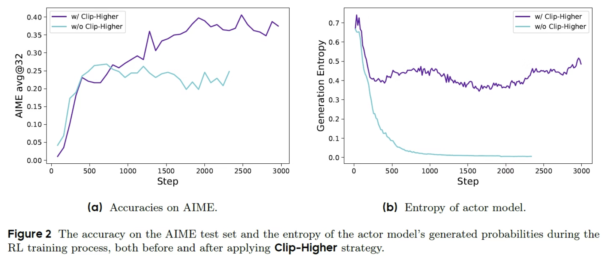
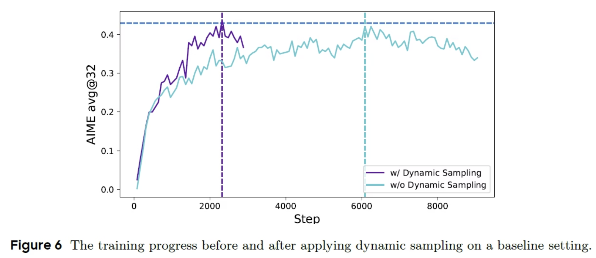
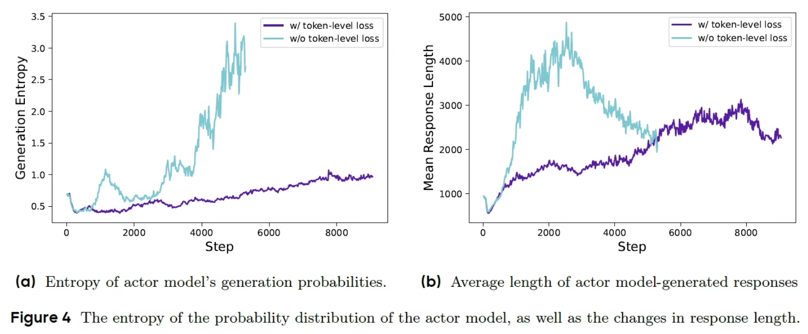
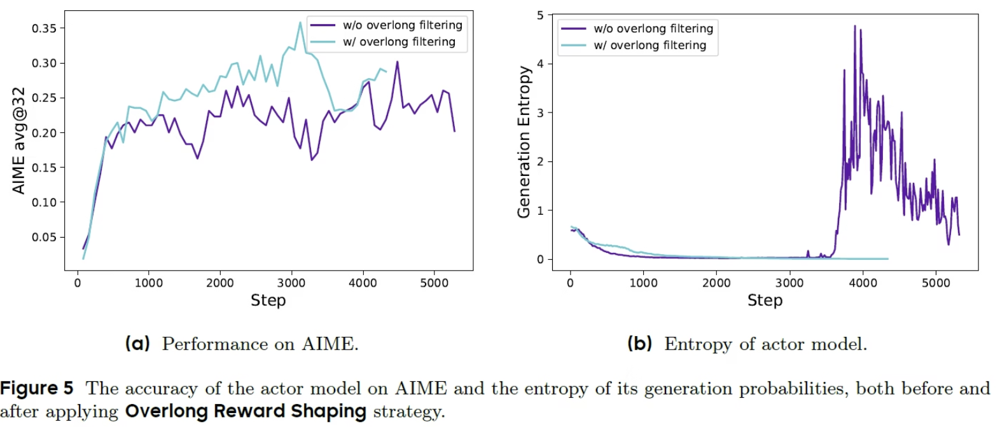

# DAPO (Decoupled Clip and Dynamic sAmpling Policy Optimization) -- 解耦裁剪与动态采样策略优化

> [!important]
> 
> 原论文：[DAPO: An Open-Source LLM Reinforcement Learning System at Scale](https://export.arxiv.org/pdf/2503.14476)
>
> 优秀博客：[DAPO: Enhancing GRPO For LLM Reinforcement Learning](https://aipapersacademy.com/dapo/)、[Swift Documentation - DAPO Deep Dive](https://swift.readthedocs.io/en/v3.12/Instruction/GRPO/AdvancedResearch/DAPO.html)
>
> 开源代码仓库：[github/BytedTsinghua-SIA/DAPO](https://github.com/BytedTsinghua-SIA/DAPO)

## 一、引言：从"理论算法"到"工业可用"

在前三篇文章中，我们沿着**PPO → DPO → GRPO**的演进脉络，见证了大模型强化学习对齐在**资源效率**和**算法简洁性**上的持续突破。GRPO通过"**组内相对优势**"的设计，成功移除了昂贵的Critic网络，将显存占用降低了40%以上。

然而，当研究者们试图将GRPO应用于**长思维链（Long Chain-of-Thought，Long CoT）推理模型**的训练时，一个令人警醒的现实浮出水面：**GRPO在长CoT场景下面临着严重的训练稳定性问题**，社区普遍遭遇复现困难。

字节跳动Seed团队与清华AIR联合实验室SIA-Lab在复现GRPO时发现：基于Qwen2.5-32B模型运行naive GRPO，在AIME 2024数学推理基准上**仅获得约30分**，而DeepSeek的RL报告显示为47分。这一**高达17分的差距**揭示了naive GRPO在**长CoT场景下的根本性缺陷**。这暗示DeepSeek R1论文中可能**省略了构建工业级、可扩展、可复现RL系统所必需的关键训练细节**。

正是在这样的背景下，**DAPO（Decoupled Clip and Dynamic sAmpling Policy Optimization，解耦裁剪与动态采样策略优化）** 应运而生。DAPO并非一个全新的算法框架，而是**在GRPO基础上，针对长CoT RL场景系统性地引入四项关键训练优化技术**，将GRPO从"理论上优雅的实验室算法"升级为"**工业级可用的生产系统**"。在AIME 2024上，DAPO达到了**50分**的SOTA水平，**仅用50%的训练步数**即超越了DeepSeek-R1-Zero（47分）。

---

## 二、GRPO在长CoT场景下的四大困境

要理解DAPO的创新，首先需要深入理解GRPO在长CoT RL训练中遇到的具体问题。

### 2.1 熵崩塌（Entropy Collapse）：探索能力的"枯竭"

在naive GRPO训练中，研究团队观察到一个致命现象：**策略的熵在训练初期就迅速下降**。这意味着模型的输出分布变得越来越"**确定**"——**某个组内的采样回答趋近于完全相同**。

**熵崩塌为什么可怕？**
- 熵是衡量模型**探索能力**的指标。熵过低意味着**探索能力严重不足**。
- 当熵崩塌时模型只会生成少数几种"**安全**"的回答模式，无法探索到可能带来**更高奖励**的新推理路径。
- 这直接导致了**RL scaling的停滞**——模型陷入了一个"局部最优陷阱"，无法自我突破。

**熵崩塌的深层机制是什么？** 我们可以从两个层面来理解：

- **第一层：GRPO对称裁剪的"天花板效应"。** 在GRPO的对称裁剪区间$[1-\epsilon, 1+\epsilon]$中，无论token原本的概率是高是低，**其相对提升比例都被限制在同一个上界$1+\epsilon$之内**。这意味着**低概率的"探索性"token即便获得了正向优势，也无法得到足够的概率增幅**——它们始终难以"翻身"。
- **第二层：Softmax归一化的"挤出效应"。** 在语言模型中，所有token的概率通过**Softmax函数归一化**，总和为1。当高概率token的概率增加时（即使增幅被裁剪限制），它会在归一化过程中**挤压其他token的概率质量**。这意味着，即使低概率token没有被直接降低，它们的概率也会因为"分母变大"而**被动下降**。这种"富者愈富、穷者愈穷"的**马太效应**，是**熵崩塌**的根本驱动力。

实验数据清晰地印证了这一分析：在naive GRPO中，模型的熵从初始值迅速跌落到接近0的水平，而**此时训练还远未收敛——探索已经"枯竭"了**。

### 2.2 稀疏奖励与样本浪费：计算资源的"空转"

在长CoT场景中，模型生成的推理链长度可能达到**数万token**。对于数学推理这类任务，**奖励信号只在最终答案处给出（0或1）**——这是一个典型的**稀疏奖励**问题。**绝大多数token的生成得不到任何有意义的即时反馈**。

更糟糕的是，当组内所有回答的奖励**完全相同**（比如全部正确或全部错误）时，GRPO的组**归一化优势全部为0**：

$$\hat{A}_i = \frac{R_i - \mu}{\sigma} = 0, \quad \text{当 } R_1 = R_2 = \cdots = R_G$$

这一整组数据**无法提供任何有效的梯度更新信号**，造成巨大的计算浪费。在一个典型训练batch中，可能有30%-50%的组是"无效组"——这些组**消耗了采样和推理的计算资源**，却对模型优化毫无贡献。

### 2.3 长序列中的梯度稀释：关键信号被"淹没"

GRPO在计算损失时采用**序列级聚合：先对每个序列内的token损失取平均，再对序列间取平均**：

$$L_{\text{GRPO}} = \frac{1}{G} \sum_{i=1}^G \frac{1}{|o_i|} \sum_{t=1}^{|o_i|} \ell_{i,t}$$

在长CoT场景中，一个回答可能包含数千个token，其中**绝大多数token与最终奖励的相关性极低**（比如"首先，让我们思考这个问题……"这类通用引导语）。这种"一刀切"的聚合方式**稀释了关键token的梯度信号**——那些真正导致正确推理的token，其贡献被成千上万个无关token的平均值所淹没。

### 2.4 长度爆炸：奖励黑客的"捷径"

在长CoT RL训练中，模型很容易发现一个"投机取巧"的策略——**生成更长的回答往往能获得更高的奖励**，因为更长的推理链有更大的概率"蒙"到正确答案，或者至少包含更多看似相关的推理步骤。

这导致模型**倾向于生成越来越长的输出**，最终超出上下文长度限制，造成训练崩溃。这是一种典型的**奖励黑客（Reward Hacking）** 行为——**模型不是在提高推理质量，而是在"玩弄"奖励函数的统计特性**。

---

## 三、DAPO的四大核心技术创新

DAPO针对上述四个问题，分别引入了四项关键技术。每一项技术都精准地瞄准了一个具体的痛点。

### 3.1 Clip-Higher：打破熵崩塌的"非对称裁剪"

**问题**：GRPO中**对称的裁剪区间$[1-\epsilon, 1+\epsilon]$对低概率token的"上界"压制过强**，导致探索不足、**熵崩塌**。

**方案**：DAPO将裁剪区间**解耦**为独立的下界和上界：

$$\text{clip}(r_{i,t}(\theta), 1-\epsilon_{\text{low}}, 1+\epsilon_{\text{high}})$$

其中$\epsilon_{\text{low}}$和$\epsilon_{\text{high}}$可以独立设置。在DAPO的典型配置中，$\epsilon_{\text{low}}=0.2$，$\epsilon_{\text{high}}=0.28$ —— **上界显著大于下界**。

**原理**：这个看似简单的改动，背后有深刻的强化学习理论考量。

回顾裁剪机制在不同优势符号下的作用：
$$
\text{目标} = \begin{cases}
\min(r_{i,t}, 1+\epsilon_{\text{high}}) \cdot \hat{A}_{i,t}, & \hat{A}_{i,t} > 0 \\
\max(r_{i,t}, 1-\epsilon_{\text{low}}) \cdot \hat{A}_{i,t}, & \hat{A}_{i,t} < 0
\end{cases}
$$
- 当 $\hat{A}_{i,t} > 0$（该token被判定为"好"），起作用的是**上界** $1+\epsilon_{\text{high}}$
- 当 $\hat{A}_{i,t} < 0$（该token被判定为"坏"），起作用的是**下界** $1-\epsilon_{\text{low}}$

**提高上界的意义**：当 **一个token被判定为"好"** 时，无论它原本的概率是高是低，模型都可以**更大幅度地提升它的概率**。这给了那些**原本概率很低但可能带来高奖励的"探索性"token**一个"翻身"的机会。

从**数学**上看，这个**非对称设计**改变了策略更新的**动力学**。在对称裁剪下，概率分布的更新倾向于**保持原有的概率排序**——高概率token保持高概率，低概率token保持低概率。而在非对称裁剪下（上界大于下界），**低概率token获得了更大的"上升空间"，使得概率分布有机会进行重新排序**——这正是探索的本质。

实验数据证实了Clip-Higher的效果：应用**Clip-Higher**后，**模型的熵不再崩塌，而是呈现出缓慢上升的趋势**，这与最终性能的提升直接相关。在AIME测试集上，Clip-Higher策略将准确率从约30分提升到了接近40分。

> [!tip]
> 为什么上界增量"仅0.08"却带来质变？
> 从相对比例看，$0.28$ 仅比 $0.2$ 高出 $40\%$。对于一个概率为 $10^{-4}$ 的低概率token，其绝对概率上界从 $1.2 \times 10^{-4}$ 提升到 $1.28 \times 10^{-4}$——绝对增量的变化其实很小。
> 真正的质变发生在**累积效应**上：在多轮迭代中，低概率token每次都能获得比原来多40%的"生长空间"，经过数十轮更新后，这种差异被**指数级放大**，最终突破了Softmax归一化形成的"概率壁垒"。

**效果**：

### 3.2 Dynamic Sampling：剔除"无效组"的动态过滤

**问题**：当组内所有回答的奖励**全部相同**（全对或全错）时，**组归一化后的优势全部为0**，这组数据无法提供**有效的梯度信号**。

**方案**：DAPO引入**动态采样（Dynamic Sampling）** 机制：
1. 对每个prompt**采样一组回答**
2. **过滤掉那些奖励全部相同（标准差为0）的组**
3. **持续采样**，直到累积足够数量的"**有效组**"（即组内同时包含正确和错误回答）
4. 用这些**有效组**构成一个训练batch

**原理**：动态采样的核心逻辑是**只有当组内存在奖励差异时，GRPO的组归一化优势才能提供有意义的"相对好坏"信号**。
  
试想：
- 如果一组回答**全部正确**（$R_i = 1, \forall i$），它们的奖励都是1，归一化后优势全是0——我们无法从中学到任何东西，因为模型已经做得很好了，但我们**不知道"为什么好"**。
- 如果一组回答**全部错误**（$R_i = 0, \forall i$），同理——模型已经做得很差了，但我们不知道"**为什么差**"。
- **只有同时包含正确和错误回答的组，才能告诉我们"什么样的推理路径是对的，什么样的是错的"**。

动态采样通过**强制要求每个batch中的每个组都包含至少一个正确和一个错误的回答**，确保了每个组都能提供**有效的对比信号**；训练batch中的每一个**数据点都有意义**；**样本效率**得到显著提升。

**效果**：

### 3.3 Token-Level Policy Gradient Loss：从"句子平均"到"Token精细"

**问题**：GRPO在计算损失时采用**序列级聚合**：

$$L_{\text{GRPO}} = \frac{1}{G} \sum_{i=1}^G \frac{1}{|o_i|} \sum_{t=1}^{|o_i|} \ell_{i,t}$$

这种"$seq-mean-token-mean$"模式意味着：一个长度为10000的序列和一个长度为100的序列在最终损失中拥有**相同的权重**（都是**先序列内平均，再序列间平均**）。**短序列**中的每个token获得了**远高于**长序列中每个token的梯度影响力。

在长CoT场景中，一个回答可能包含数千个token，其中**绝大多数token与最终奖励的相关性极低**——这种聚合方式严重**稀释了关键token的梯度信号**。

**方案**：DAPO采用**Token级别的策略梯度损失**（$Token-Level$ $Policy$ $Gradient$ $Loss$）:

$$\mathcal{L}_{\text{DAPO}} = \frac{1}{\sum_{i=1}^G |o_i|} \sum_{i=1}^G \sum_{t=1}^{|o_i|} \ell_{i,t}$$

这种"$token-mean$"模式直接**对所有序列的所有token的损失取平均**——所有token平等对待。

**原理**：这两种聚合方式的差异看似只是计算顺序不同，但在长序列场景中影响巨大：

| 聚合模式 | 计算方式 | 数学表达 | 长序列token权重 | 短序列token权重 |
|---------|---------|--------|--------|---------|
| **seq-mean-token-mean (GRPO)** | **先序列内平均，再序列间平均** | $\mathcal{L}_{\text{GRPO}} = \frac{1}{G} \sum_{i=1}^G \frac{1}{\|o_i\|} \sum_{t=1}^{\|o_i\|} \ell_{i,t}$ | **低** | **高** |
| **token-mean (DAPO)** | **直接全局平均** | $\mathcal{L}_{\text{DAPO}} = \frac{1}{\sum_{i=1}^G \|o_i\|} \sum_{i=1}^G \sum_{t=1}^{\|o_i\|} \ell_{i,t}$ | **平等** | **平等** |

在采用**Token级别的策略梯度损失**（$Token-Level$ $Policy$ $Gradient$ $Loss$）下，长序列中成千上万个token的梯度信号**不会被压缩到一个"序列平均值"中**，每一个token的贡献都被充分考虑到。这样的设计使得**梯度信号**更加精细和丰富，模型可以更精准地学习**哪些token模式导致了高奖励**。

实验数据验证了这一点：**移除Token-Level Loss后，DAPO的性能从52%下降到44%**——8个百分点的巨大差距，充分说明了在长CoT场景中token级别梯度精细化的重要性。

**效果**：

### 3.4 Overlong Reward Shaping：驯服"越长越好"的奖励黑客

**问题**：在长CoT RL训练中，模型很容易发现一个"投机取巧"的策略——**生成更长的回答往往能获得更高的奖励**，因为更长的推理链有更大的概率"蒙"到正确答案。这导致模型倾向于生成**越来越长**的输出，最终**超出上下文长度限制**，造成**训练崩溃**。

**方案**：DAPO 引入**过长奖励塑形（Overlong Reward Shaping）**，通过**对超长响应施加惩罚**来引导模型生成**合适长度**的答案。

设定两个**关键参数**：
- `max_response_length`（记作 \(L_{\text{max}}\)）：**硬截断上限**，响应长度超过此值将受到最大惩罚。
- `overlong_buffer_len`（记作 \(L_{\text{cache}}\)）：**缓冲区间长度**，用于平滑过渡惩罚。

**长度惩罚函数**：**惩罚项** \(P(L)\)（正数，表示从原始奖励中扣除的数值）定义为三阶段，推导的长度奖励塑形项（负数）为：

$$
R_{\text{length}}(L) = -P(L) =
\begin{cases}
0, & L \le L_{\text{max}} - L_{\text{cache}} \\[6pt]
\dfrac{(L_{\text{max}} - L_{\text{cache}}) - L}{L_{\text{cache}}}, & L_{\text{max}} - L_{\text{cache}} < L \le L_{\text{max}} \\[6pt]
-1, & L > L_{\text{max}}
\end{cases}
$$
其中**阈值** $T = L_{\text{max}} - L_{\text{cache}}$，当响应长度 \(L\) 超过 \(T\) 时，开始施加惩罚。

**奖励塑形公式**：最终奖励为原始奖励加上长度惩罚项（即减去惩罚）：

$$R_{\text{shaped}} = R_{\text{original}} + R_{\text{length}}(L) = R_{\text{original}} - P(L)$$

若引入可选的 `penalty_factor`（默认为 1.0），则惩罚可缩放为：

$$P(L) = \min\left( \frac{\max(0, L - T)}{L_{\text{cache}}} \times \text{penalty\_factor},\; 1 \right)$$

当 `penalty_factor = 1` 时，与上述分段函数完全一致。

**行为说明**：
- **\(L \le T\)**：无惩罚，奖励保持不变。  
- **\(T < L \le L_{\text{max}}\)**：惩罚从 0 线性递增至 1，奖励相应线性递减。  
- **\(L > L_{\text{max}}\)**：施加最大惩罚 1（即奖励额外扣除 1），强制截断。

该机制**有效抑制了过长生成**，同时通过缓冲区间**避免了硬截断带来的奖励突变**。

**原理**：

这个设计非常巧妙，它不是"**硬截断**"（超过长度直接丢弃或给0分），而是**渐进式惩罚**：

- **硬截断**：$L > \text{max\_response\_length}$ 时**奖励直接归0或丢弃样本**，造成奖励信号的**剧烈不连续性**。
- **渐进式惩罚**：在缓冲区内，奖励随长度增加**线性递减**，形成一个"**软边界**"，这给模型一个**平滑的梯度信号**，让它学会在**质量和长度**之间寻找平衡；惩罚因子`penalty_factor`控制惩罚的**强度**，默认为1.0。

这种平滑设计带来的好处：
1. **训练稳定性**：避免了奖励的**剧烈跳变**
2. **可学习性**：模型可以逐渐学会在**质量和长度**之间寻找平衡
3. **灵活性**：允许模型偶尔生成长回答来**探索高奖励区域**，但不会失控

值得注意的是，在DAPO论文的最佳性能实验中，**Overlong Filtering（硬过滤）并未被启用**，因为其功能与**Overlong Reward Shaping**有所重叠。渐进式惩罚已经足够有效地控制了长度爆炸问题。

**效果**：

---

## 四、DAPO的算法框架

### 4.1 完整目标函数

综合上述四项技术，DAPO的完整目标函数为：

$$
\mathcal{J}_{\text{DAPO}}(\theta) = \mathbb{E}_{q \sim P(Q), \{o_i\}_{i=1}^G \sim \pi_{\theta_{\text{old}}}(\cdot|q)} \left[ \frac{1}{\sum_{i=1}^G |o_i|} \sum_{i=1}^G \sum_{t=1}^{|o_i|} \min\left( r_{i,t}(\theta) \hat{A}_{i,t},\; \text{clip}(r_{i,t}(\theta), 1-\epsilon_{\text{low}}, 1+\epsilon_{\text{high}}) \hat{A}_{i,t} \right) \right]
$$

**各符号的完整定义**：

| 符号 | 含义 | 备注 |
|------|------|------|
| $q$ | 输入prompt | 来自问题分布 $P(Q)$ |
| $o_i$ | 第 $i$ 个回答 | 从旧策略 $\pi_{\theta_{\text{old}}}$ 中采样 |
| $G$ | 组大小 | 每个prompt采样的回答数，通常 $G=8\sim16$ |
| $r_{i,t}(\theta)$ | 重要性采样比率 | $r_{i,t}(\theta) = \frac{\pi_\theta(o_{i,t} \mid q, o_{i,<t})}{\pi_{\theta_{\text{old}}}(o_{i,t} \mid q, o_{i,<t})}$ |
| $\hat{A}_{i,t}$ | 组相对优势 | $\hat{A}_{i,t} = \frac{R_i - \mu}{\sigma}$，组内所有token共享 |
| $\epsilon_{\text{low}}$ | 裁剪下界 | 典型值 $0.2$，控制负优势时的最大降幅 |
| $\epsilon_{\text{high}}$ | **裁剪上界** | 典型值 $0.28$，控制正优势时的最大增幅 |
| $\frac{1}{\sum_{i=1}^G \|o_i\|}$ | **Token-Level归一化** | **所有token平等对待** |

### 4.2 核心伪代码

DAPO的训练流程本质上与GRPO相同，但在采样、损失计算和奖励处理三个环节引入了上述四项改进。以下是用**Python伪代码**表达的完整流程，重点标注了与GRPO的差异：

```python
import torch
import numpy as np
from typing import List, Dict

# ==================== 超参数配置 ====================
# GRPO继承的超参数
GROUP_SIZE = 16              # 组大小G
EPSILON_LOW = 0.2            # 裁剪下界 (DAPO: 解耦)
EPSILON_HIGH = 0.28          # 裁剪上界 (DAPO: 更高)
LEARNING_RATE = 1e-6
EPOCHS_PER_ITER = 5

# DAPO特有超参数
MAX_RESPONSE_LENGTH = 16384      # 最大响应长度
OVERLONG_BUFFER_LEN = 4096       # 过长的缓冲区间
PENALTY_FACTOR = 1.0             # 惩罚因子
DYNAMIC_SAMPLING_ENABLED = True  # 是否启用动态采样
MAX_GEN_BATCHES = 50             # 最大采样尝试次数

# ==================== 动态采样函数 ====================
def dynamic_sampling(prompts, model_actor, model_rm, group_size=GROUP_SIZE):
    """
    DAPO创新点2: 过滤全对/全错组，只保留有效组
    """
    effective_groups = []
    # 为每个prompt独立采样
    for prompt in prompts:
        for attempt in range(MAX_GEN_BATCHES):
            # 采样一组回答
            responses = model_actor.sample(prompt, num_samples=group_size)
            # 计算奖励
            rewards = [model_rm.score(prompt, resp) for resp in responses]
            
            # 检查组内是否有差异 (标准差 > 0)
            if np.std(rewards) > 1e-8:
                # 有效组: 包含至少一个正确和一个错误
                effective_groups.append({
                    "prompt": prompt,
                    "responses": responses,
                    "rewards": rewards
                })
                break
            # 如果全部相同，继续采样 (动态采样的核心)
    return effective_groups

# ==================== 过长奖励塑形函数 ====================
def apply_overlong_shaping(rewards: List[float], lengths: List[int]) -> List[float]:
    """
    DAPO创新点4: 对过长回答施加渐进式惩罚
    """
    shaped_rewards = rewards.copy()
    buffer_start = MAX_RESPONSE_LENGTH - OVERLONG_BUFFER_LEN
    
    for i, length in enumerate(lengths):
        if length > buffer_start:
            exceed_len = length - buffer_start
            # 线性递减惩罚
            penalty = min(exceed_len / OVERLONG_BUFFER_LEN * PENALTY_FACTOR, 0)
            # 注意: 惩罚是负值，直接加到奖励上
            shaped_rewards[i] += penalty
    
    return shaped_rewards

# ==================== 主训练循环 ====================
for iteration in range(total_iterations):
    
    # ---------- Step 1: 组采样 (DAPO: 动态采样过滤) ----------
    if DYNAMIC_SAMPLING_ENABLED:
        # DAPO: 只保留有效组 (组内奖励有差异)
        groups = dynamic_sampling(prompts_batch, model_actor, model_rm)
    else:
        # GRPO: 朴素采样，可能包含无效组
        groups = naive_sampling(prompts_batch, model_actor, model_rm)
    
    # ---------- Step 2: 奖励计算与归一化 ----------
    for group in groups:
        # 计算参考模型log概率 (用于KL，但DAPO移除了KL)
        ref_log_probs = model_ref.compute_log_probs(group["responses"])
        group["ref_log_probs"] = ref_log_probs
        
        # DAPO: 应用过长奖励塑形
        response_lengths = [len(resp) for resp in group["responses"]]
        group["rewards"] = apply_overlong_shaping(
            group["rewards"], 
            response_lengths
        )
        
        # 组内归一化 -> 优势值 (与GRPO相同)
        rewards = group["rewards"]
        mean_r = np.mean(rewards)
        std_r = np.std(rewards) + 1e-8
        group["advantages"] = [(r - mean_r) / std_r for r in rewards]
    
    # ---------- Step 3: 策略更新 (DAPO: Token-Level Loss) ----------
    # 将所有有效组展平为统一的训练集
    dataset = flatten_experiences(groups)
    
    for epoch in range(EPOCHS_PER_ITER):
        for batch in sample_batches(dataset, BATCH_SIZE):
            # 计算概率比
            new_log_probs = model_actor.compute_log_probs(batch["responses"])
            ratio = torch.exp(new_log_probs - batch["log_probs"])
            
            # 获取优势 (每个回答一个标量)
            advantages = batch["advantages"].unsqueeze(-1)  # [B, 1]
            
            # ---------- DAPO: Clip-Higher (解耦裁剪) ----------
            # 独立设置下界和上界
            surr1 = ratio * advantages
            surr2 = torch.clamp(ratio, 1 - EPSILON_LOW, 1 + EPSILON_HIGH) * advantages
            policy_loss_per_token = -torch.min(surr1, surr2)
            
            # ---------- DAPO: Token-Level聚合 ----------
            # 直接在所有token上取平均 (不先按序列平均)
            # 这是DAPO与GRPO在损失聚合上的关键差异
            policy_loss = policy_loss_per_token.mean()
            
            # ---------- DAPO: 移除KL散度约束 ----------
            # 不再添加 KL(π_θ || π_ref) 惩罚项
            # 模型可以自由探索新的推理路径
            
            # ---------- 可选: 熵奖励 ----------
            entropy = model_actor.compute_entropy(batch["responses"]).mean()
            entropy_bonus = -ENTROPY_COEFF * entropy
            
            loss = policy_loss + entropy_bonus
            
            optimizer.zero_grad()
            loss.backward()
            torch.nn.utils.clip_grad_norm_(model_actor.parameters(), max_norm=1.0)
            optimizer.step()
```

### 4.3 DAPO vs GRPO

| 维度 | GRPO | DAPO | 改进效果 |
|------|------|------|---------|
| **裁剪区间** | 对称 $[1-\epsilon, 1+\epsilon]$ | 非对称 $[1-\epsilon_{\text{low}}, 1+\epsilon_{\text{high}}]$ | **打破熵崩塌** |
| **动态采样** | 无（直接使用所有采样组） | **过滤全对/全错组** | **提升样本效率** |
| **损失聚合** | **序列级平均**（$seq-mean-token-mean$） | **Token级平均**（$token-mean$） | **精细梯度信号** |
| **长度控制** | 硬截断 | **渐进式奖励惩罚** | **平滑长度约束** |
| **KL散度** | 包含 | **移除** | **释放探索能力** |

### 4.4 DAPO解决的问题

1. **解决了GRPO在长CoT场景下的熵崩塌问题**：通过Clip-Higher的非对称裁剪设计，**DAPO让低概率的"探索"token也能获得有效的概率提升，从根本上打破了熵迅速崩塌的恶性循环**。实验表明，应用Clip-Higher后，策略熵从训练初期的快速下降转变为缓慢上升，模型保持了持续的探索能力。
2. **解决了无效样本的计算浪费问题**：通过**动态采样**，DAPO确保每个训练batch中的每一组数据都能提供**有效的梯度信号**，**大幅提升了样本效率**。在典型训练中，动态采样将有效组的比例从50%-70%提升到接近100%。
3. **解决了长序列中的梯度稀释问题**：通过**Token-Level损失聚合**，DAPO让长CoT中**每一个token**的贡献都能被充分体现，**实现了更精细的策略优化**。这是四项技术中对性能贡献最大的一项（8个百分点的提升）。
4. **解决了"越长越好"的奖励黑客问题**：通过**Overlong Reward Shaping的渐进式惩罚**，DAPO在**鼓励模型探索长推理链**的同时，**有效抑制了长度失控**。模型学会了在推理质量和回答长度之间寻找平衡。
5. **解决了RL训练的可复现性问题**：DAPO团队**完整开源了其训练代码、数据集和详细配置**（基于verl框架），使得整个社区都能够复现其工业级的RL训练结果——这在之前是几乎不可能的。这一开源行动本身，就是对社区的重大贡献。

---

## 五、GRPO的适用场景、优势与局限

### 5.1 适用场景

1. **长思维链推理训练**：这是DAPO被设计出来的核心场景，在**数学推理（AIME）、代码生成**等需要长CoT的任务上效果显著。
2. **可验证奖励的任务**：DAPO采用**基于规则的奖励模型**（最终答案是否正确），**无需训练独立的奖励模型**，避免了奖励黑客问题。
3. **需要大规模并行训练的场景**：DAPO基于verl框架实现，天然支持**分布式**训练。
4. **追求SOTA推理能力的团队**：DAPO在AIME 2024上达到了50分的SOTA水平（基于Qwen2.5-32B）。
5. **需要可复现RL训练的团队**：DAPO完整开源了代码、数据和配置，使得复现工业级RL结果成为可能。

### 5.2 核心优势

| 优势 | 说明 |
|------|------|
| **解决熵崩塌** | Clip-Higher从根本上打破了**探索不足的恶性循环**，模型熵值在训练中保持健康水平 |
| **样本效率高** | **动态采样**确保每个batch的数据都有价值，有效组比例接近100% |
| **梯度精细** | **Token-Level损失**让长序列中每个token都有贡献，对性能贡献最大（+8%） |
| **长度可控** | **渐进式惩罚**有效抑制长度爆炸，训练稳定性显著提升 |
| **可复现性强** | 完整开源，社区可复现工业级结果，填补了DeepSeek R1留下的技术空白 |
| **性能SOTA** | AIME 2024上50分，超越DeepSeek-R1-Zero，且仅用50%训练步数 |
| **无需KL散度** | 移除了不必要的KL约束，释放模型在推理路径上的探索能力 |

### 5.3 核心局限

| 局限 | 说明 |
|------|------|
| **超参数增多** | Clip-Higher引入了$\epsilon_{\text{low}}$和$\epsilon_{\text{high}}$两个独立超参数，需要分别调优 |
| **动态采样有额外开销** | 需要**反复采样**直到累积足够的有效组，可能增加生成开销（约20-30%的额外采样成本） |
| **依赖可验证奖励** | 目前主要适用于**有明确答案的任务**（数学、代码），泛化到开放式任务（如创意写作、对话）需额外设计奖励信号 |
| **仍存在训练不稳定性风险** | 尽管有所改善，大规模RL训练仍然存在崩溃风险，需要精心设计的训练监控和恢复机制 |
| **主要在32B规模验证** | 在更大规模模型（如70B、百亿参数以上）上的效果有待进一步验证 |
| **Overlong Shaping参数敏感** | 缓冲区间长度和惩罚因子需要根据任务调优，不同任务的最优配置可能不同 |

---

> [!note]
> 如果说GRPO回答的是"**如何用组内相对比较替代价值网络**"的问题，那么DAPO回答的则是一个更为工程化但也更为现实的问题：**如何将GRPO从一个"理论上优雅"的算法，打磨成一个"工业上可用"的系统？**
> 
> DAPO通过四项精妙的技术创新给出了答案：
> | 改进点 | 核心机制 | 改进定位 |
> |--------|----------|----------|
> | **Clip-Higher** | **非对称裁剪**，给**低概率** token 提供“翻身”机会，打破**熵崩塌**恶性循环 | 对 GRPO 裁剪机制的**定性改进** |
> | **Dynamic Sampling** | **过滤无效组**，确保每一份计算资源都用在有效样本上 | 对采样流程的**效率优化** |
> | **Token-Level Loss** | **精细化梯度聚合**，使长序列中每个 token 都能贡献于策略优化 | 对损失计算方式的**精度提升** |
> | **Overlong Reward Shaping** | **渐进式惩罚**，在鼓励探索与控制长度之间取得**平衡** | 对奖励信号的**精细化设计** |
> 
> 这四项技术每一项都是**对现有机制的精心调优和改良**。正是这些"小而精"的改进汇聚在一起，将GRPO从30分推到了50分，超越了DeepSeek-R1-Zero的成绩，且仅用了50%的训练步数。
> 
> 在大模型强化学习对齐这个领域，**"算法框架"只是起点，"训练细节"才是决定成败的关键**。从PPO到GRPO是框架层面的飞跃，而从GRPO到DAPO则是工程层面的精雕细琢。两者缺一不可。
> 
> DAPO的完整开源，使得整个社区都能够站在巨人的肩膀上继续前进。DAPO不仅仅是一个算法，更是一个**可复现、可扩展、可迭代的工业化RL系统**。