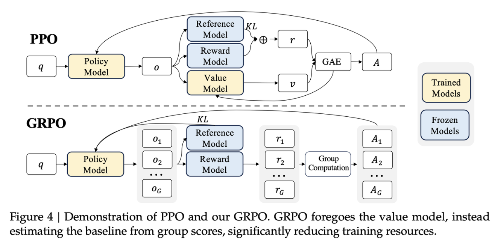
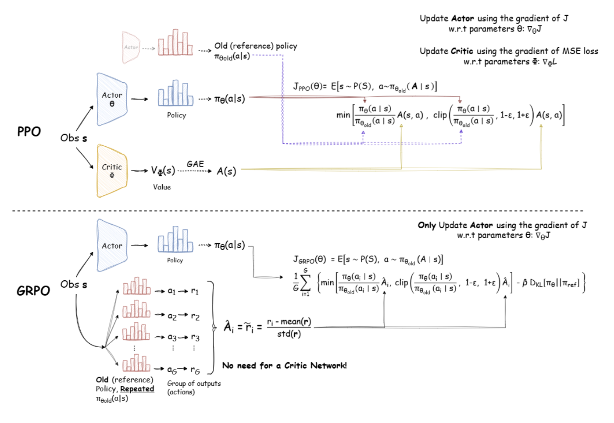
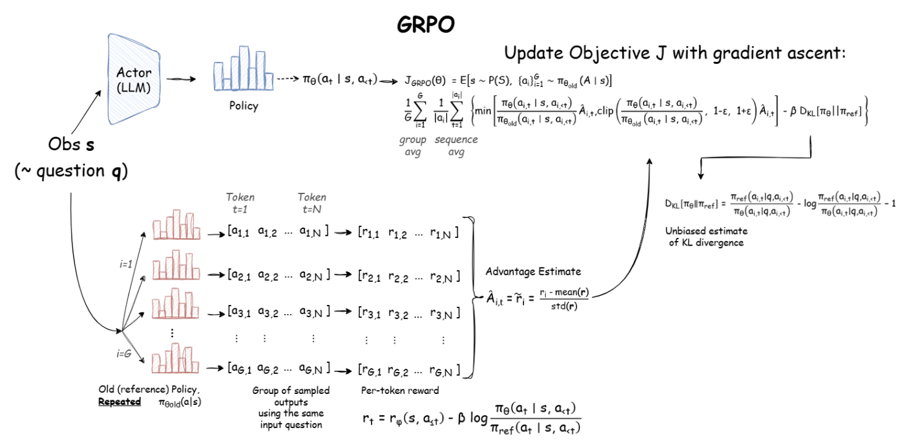

# GRPO (Group Relative Policy Optimization) -- 群体相对策略优化

> [!important]
> 
> 原论文：[DeepSeekMath: Pushing the Limits of Mathematical Reasoning in Open Language Models](https://arxiv.org/pdf/2402.03300)
>
> 优秀博客：[DeepSeek-R1 Dissection: Understanding PPO & GRPO Without Any Prior Reinforcement Learning Knowledge](https://huggingface.co/blog/NormalUhr/grpo)、[Why GRPO is Important and How it Works](https://ghost.oxen.ai/why-grpo-is-important-and-how-it-works/)、[Group Relative Policy Optimization (GRPO) Illustrated Breakdown](https://epichka.com/blog/2025/grpo/)
>
> TRL库：[huggingface/trl/grpo_trainer](https://github.com/huggingface/trl/blob/main/docs/source/grpo_trainer.md)

## 一、引言：从PPO的"重"到GRPO的"轻"

### 1.1 PPO与DPO的问题

在前两篇文章中，我们分别探讨了两种主流的对齐范式：

- **PPO（Proximal Policy Optimization）** ：通过**裁剪机制和KL散度约束**实现**稳定策略更新**，是RLHF的事实标准。但需要同时维护**四个模型**（Actor、Critic、Reward Model、Reference Model），其中**Critic（价值网络）的规模与策略模型相当**。在千亿参数大模型时代，这意味着**双倍的显存占用和计算开销**。更关键的是，Critic网络需要根据已生成的部分内容预测最终**累积奖励**——这在长链推理场景中极易出现**预测偏差**，且训练本身就**不稳定**。

- **DPO（Direct Preference Optimization）** ：通过数学推导将RLHF简化为监督学习，只需**两个模型**。但作为离线算法，DPO**完全依赖静态偏好数据**，无法像PPO那样在训练中动态探索新策略。对于需要模型**自主探索推理路径**的复杂任务（如数学推理、代码生成），DPO的能力边界明显。

这引出了一个关键问题：**能否在保留PPO在线探索能力的同时，移除那个昂贵的Critic网络？**

### 1.2 GRPO算法提出背景



2024年，DeepSeek团队在**DeepSeekMath**论文中给出了答案——**GRPO（Group Relative Policy Optimization，群体相对策略优化）** 。其核心思想是：优势函数不一定要通过"**预测绝对价值**"来获得。对于**同一个prompt**生成的**一组回答**，它们的**相对优劣本身**就蕴含了足够的更新信号。

换言之，**GRPO不再训练一个价值网络来估计"这个回答的绝对分数是多少"，而是让模型对同一个prompt生成一组回答，直接用组内的相对排名来指导学习**。这就像一场考试：PPO需要一个"**绝对分数标准**"来评判每个学生（Critic网络），而GRPO只需要看每个学生在班级里的**相对排名**就够了。

这一设计将RLHF的模型数量从**4个降至3个**（移除Critic），显存占用降低**40%以上**，同时保留了**在线探索**能力。它随后被用于DeepSeek-R1-Zero和DeepSeek-R1的训练，成为支撑其突破性推理能力的**核心方法论**。

---

## 二、GRPO的核心原理

### 2.1 PPO的Critic困境



在PPO中，优势函数的计算依赖Critic网络对状态价值的估计：
$$A_t = Q(s_t, a_t) - V(s_t)$$

其中 $V(s_t)$ 是Critic网络预测的"**当前状态的平均期望回报**"。这个设计的核心问题在于：

1. **资源消耗巨大**：需要训练一个**与策略模型规模相当的独立价值网络**
2. **训练不稳定**：Critic网络的**预测误差**会通过优势函数直接传导至**策略更新**，形成**误差放大**效应
3. **长序列预测困难**：在推理任务（如数学证明、长文本生成）中，Critic需要根据**已生成**的部分内容**预测尚未发生**的最终奖励，极易出错——这是一个极具挑战性的**信用分配** 问题

### 2.2 GRPO的组内相对优势



GRPO的解决方案直击要害：**对于同一个prompt，从旧策略中采样$G$个回答组成一个"组"，直接用组内奖励的均值和标准差来归一化每个回答的奖励，作为优势估计**。

具体来说，对于prompt $q$，从旧策略$\pi_{\theta_{old}}$中**采样$G$个回答**$\{o_1, o_2, ..., o_G\}$，每个回答通过**奖励模型**得到一个奖励值$\{R_1, R_2, ..., R_G\}$。对于第$i$个回答中的第$t$个token，其优势为：

$$\hat{A}_{i,t} = \frac{R_i - \text{mean}(\{R_j\}_{j=1}^G)}{\text{std}(\{R_j\}_{j=1}^G)}$$

$$\text{mean}(\{R_j\}_{j=1}^G) = \frac{1}{G}\sum_{j=1}^G R_j, \quad \text{std}(\{R_j\}_{j=1}^G) = \sqrt{\frac{1}{G}\sum_{j=1}^G (R_j - \mu)^2 + \epsilon}$$

这个公式的含义非常直观：
- **分子**$R_i - \text{mean}(\{R_j\})$：**衡量当前回答相比组内平均水平的优劣**
- **分母**$\text{std}(\{R_j\})$：**用组内标准差进行归一化**，使优势值在不同组之间具有**可比性**。其中$\epsilon$是极小常数（如1e-8），**防止除零**
- 最终得到的优势值：**正数表示这个回答比组内平均水平好，负数表示比平均水平差，绝对值大小表示好/差的程度**

关键设计决策：**组内所有token共享同一个优势值**——因为奖励通常是在**整个回答层面**计算的（如数学题答案是否正确）。这意味着GRPO不进行token级别的细粒度优势分配，而是**将回答级别的"好/坏"信号均匀地传递给生成过程中的每一个token**。

从**对比学习**的视角来看，GRPO的组内归一化实际上构建了一个**对比目标**：组内奖励较高的回答获得正优势（被鼓励），较低的获得负优势（被抑制）。这相当于在回答空间中执行了一个**soft ranking**——模型不仅要知道"**什么是好的**"，还要学会在候选集中**区分好坏**。

### 2.3 GRPO的目标函数

与PPO类似，GRPO也采用**裁剪代理目标** ，并加入**KL散度约束**（通常以奖励塑形的形式实现）：

$$\mathcal{J}_{GRPO}(\theta) = \mathbb{E}_{q \sim P(Q), \{o_i\}_{i=1}^G \sim \pi_{\theta_{old}}(O|q)} \left[ \frac{1}{G} \sum_{i=1}^G \frac{1}{|o_i|} \sum_{t=1}^{|o_i|} \min\left( r_{i,t}(\theta) \hat{A}_{i,t}, \text{clip}(r_{i,t}(\theta), 1-\epsilon, 1+\epsilon) \hat{A}_{i,t} \right) \right] - \beta D_{KL}(\pi_\theta || \pi_{ref})$$

其中$r_{i,t}(\theta) = \frac{\pi_\theta(o_{i,t}|q, o_{i,<t})}{\pi_{\theta_{old}}(o_{i,t}|q, o_{i,<t})}$是**重要性采样比率**，衡量新策略与旧策略在生成该token上的概率比值。

这个目标函数与PPO的核心差异只有一处：**优势$\hat{A}_{i,t}$的计算方式**。PPO依赖**Critic网络**估计的$V(s_t)$，而GRPO直接用**组内归一化奖励**替代。所有其他组件——裁剪机制、KL约束、重要性采样——都得以完整保留。

**实际实现中的简化**：DeepSeek团队的实现采用了一种更简洁的形式，直接最大化以下目标：

$$
\mathcal{J}_{GRPO}(\theta) \approx \mathbb{E}\left[ \frac{1}{G} \sum_{i=1}^G \min\left( \frac{\pi_\theta(o_i \mid q)}{\pi_{\theta_{old}}(o_i \mid q)} A_i, \operatorname{clip}\left(\frac{\pi_\theta(o_i \mid q)}{\pi_{\theta_{old}}(o_i \mid q)}, 1-\epsilon, 1+\epsilon\right) A_i \right) \right]
$$

其中 $A_i = \hat{A}_{i,t}$（**组内所有token共享同一优势值**），整体概率比基于整个回答序列计算。这种简化利用了语言模型自回归分解的性质，在工程实现上更加高效。

### 2.4 GRPO的白化操作：统计学的视角

GRPO对组内奖励进行**均值-标准差归一化（又称白化）**，这并非可有可无的设计，而是有深刻的统计学考量。

- 在强化学习中，**优势函数的尺度直接影响策略更新的幅度**。如果不同batch之间的**奖励尺度**差异很大，那么**梯度更新的步长**就会随之剧烈波动，导致训练不稳定。通过**除以组内标准差**，GRPO将优势值**标准化到统一的尺度**上，使得策略更新在不同batch之间保持**一致的步长**。
- 从信息论的角度看，这种归一化操作实际上是在**消除奖励分布的位置和尺度对更新信号的影响**，使得更新信号纯粹反映"**相对优劣**"。这类似于深度学习中的**Batch Normalization**——它不改变信息的本质，但显著改善了优化过程的动力学特性。
- 更深入地说，GRPO的**均值+方差归一化**实际上诱导出了一个**加权对比损失**，其中对比样本是从旧策略中采样的合成数据。这意味着GRPO在本质上是在做一个"**组内对比学习**"——**让模型学会区分组内"好"与"坏"的回答，而不仅仅是追求绝对的高奖励**。这种对比性质使得GRPO在面对奖励模型的"标定漂移"（不同prompt之间奖励尺度不一致）时具有天然的鲁棒性。

用代码来理解会更直观：

```python
def grpo_advantage(rewards: List[float]) -> List[float]:
    """
    计算GRPO的组内相对优势
    Args: rewards: 组内G个回答的奖励值列表
    Returns: 归一化后的优势值列表，每个回答对应一个优势
    """
    G = len(rewards)
    mean_reward = sum(rewards) / G
    # 计算样本标准差（Bessel校正）
    variance = sum((r - mean_reward) ** 2 for r in rewards) / G
    std_reward = variance ** 0.5 + 1e-8  # 加小常数防止除零
    
    advantages = [(r - mean_reward) / std_reward for r in rewards]
    return advantages
```

### 2.5 GRPO的理论性质：U-统计量视角

2026年的一项理论工作为GRPO提供了更深层的数学理解。研究发现：**GRPO的策略梯度本质上是一个U-统计量（U-statistic）** ——一类在统计学中具有优良渐近性质的估计量——它在估计总体参数时具有**最小渐近方差**。

具体来说，GRPO使用**基于组的平均作为优势估计器**，其梯度可以表示为：

$$
\hat{g}_{GRPO} = \frac{1}{G} \sum_{i=1}^G \nabla_\theta \log \pi_\theta(o_i) \cdot \frac{R_i - \mu}{\sigma}
$$

这一估计器具备以下理论性质：
- **一致性**：当组大小 $G \to \infty$ 时，GRPO的梯度估计收敛到使用**真实优势函数**的梯度
- **有限样本误差界**：**均方误差**（MSE）随 $1/G$ 衰减，刻画了组大小对估计精度的量化影响
- **次优间隙的渐近分布**：为算法**收敛速度**提供了理论保证

这一理论分析揭示了GRPO的一个深层特性：**虽然GRPO去掉了显式的价值网络，但通过组内采样和归一化，它隐式地实现了与"拥有完美价值网络"的算法渐近等价的效果**。换句话说，当组大小$G$足够大时，GRPO的优势估计精度可以逼近甚至达到完美Critic的水平。

然而，同期另一项研究也指出了GRPO的理论边界：**GRPO本质上是一个保守的重新加权方案，其探索边界受限于基座模型的分布**——这意味着它**无法自主发现完全新颖的解决方案**。这一发现与后来的实践观察一致：GRPO在需要模型"跳出框架"进行创造性思考的任务中，表现确实存在天花板。

---

## 三、GRPO的训练流程

### 3.1 训练流程步骤

1. **组采样（Group Rollout）**：对于每个prompt $q$，从当前策略 $\pi_{\theta_{old}}$ 中**并行采样 $G$ 个回答**（通常 $G = 8 \sim 16$），这些回答构成一个"**组**"，是GRPO算法统计推断的基本单元。
2. **奖励计算（Reward Scoring）**：**奖励模型**（或可验证的规则）对每个回答打分，得到 $\{R_1, R_2, \ldots, R_G\}$
   - 对于可验证任务（如数学题），奖励可以是**规则的二元判断**（正确/错误）
   - 对于开放式任务，则依赖**训练好的奖励模型**提供连续评分。
3. **优势计算与白化（Advantage Normalization）**：计算组内均值和标准差，对每个回答，计算归一化优势 $\hat{A}_i = (R_i - \mu) / \sigma$，组内**所有token共享同一优势值**
4. **策略优化（Policy Update）**：使用GRPO目标函数，在采样数据上进行多轮**小批量梯度更新**
   - **裁剪机制**（$\epsilon$）限制更新幅度
   - **可选KL散度约束**防止偏离参考模型过远

**实际工程中的优化**：
- **推理与训练并行**：使用**vLLM**等高效推理框架进行组采样，**采样与梯度更新交替进行**
- **组采样的批次设计**：通常将多个prompt的组采样合并为一个**大的推理batch**，最大化GPU利用率
- **奖励模型缓存**：对于确定性奖励（如数学题答案），可**缓存计算结果**避免重复计算

### 3.2 核心伪代码

```python
import torch
from typing import List, Dict
from transformers import AutoModelForCausalLM

# ==================== 初始化阶段 ====================
# 1. 加载参考模型 (通常是SFT后的模型，冻结)
model_ref = AutoModelForCausalLM.from_pretrained("sft_model")
for param in model_ref.parameters():
    param.requires_grad = False

# 2. 加载待训练的策略模型 (从SFT模型初始化)
model_actor = AutoModelForCausalLM.from_pretrained("sft_model")

# 3. 加载奖励模型 (或使用可验证的规则，如数学答案检查器)
model_rm = AutoModelForCausalLM.from_pretrained("reward_model")

# 4. 加载prompt数据集
prompts_dataset = load_prompts("math_train_prompts.jsonl")

# 超参数
GROUP_SIZE = 16          # 组大小G
EPSILON = 0.2            # 裁剪范围
KL_BETA = 0.01           # KL惩罚系数
LEARNING_RATE = 1e-6
EPOCHS_PER_ITER = 5      # 每批数据的复用轮数
BATCH_SIZE = 128

optimizer = torch.optim.AdamW(model_actor.parameters(), lr=LEARNING_RATE)

# ==================== 主训练循环 ====================
for iteration in range(total_iterations):
    
    # ---------- Step 1: 组采样 (Group Sampling) ----------
    # 对于每个prompt，从当前策略并行采样G个回答
    grouped_experiences = []  # 存储所有组的经验
    
    for prompt_batch in dataloader(prompts_dataset, batch_size=BATCH_SIZE):
        # 对batch中的每个prompt，采样G个回答
        # 这里使用并行采样提升效率，实际可用vLLM等推理框架
        for prompt in prompt_batch:
            # 从当前策略采样G个回答
            responses = model_actor.sample(
                prompt, 
                num_samples=GROUP_SIZE,
                temperature=0.7,  # 适度温度确保组内多样性
                max_length=2048
            )
            
            # 计算每个回答的生成概率 (用于后续重要性比率的计算)
            log_probs = model_actor.compute_log_probs(responses)
            
            grouped_experiences.append({
                "prompt": prompt,
                "responses": responses,
                "log_probs": log_probs,  # shape: [G, seq_len]
                "ref_log_probs": model_ref.compute_log_probs(responses)
            })
    
    # ---------- Step 2: 奖励计算与组内归一化 (Reward & Normalization) ----------
    for group in grouped_experiences:
        # 计算每个回答的奖励 (通过奖励模型或规则)
        rewards = []
        for response in group["responses"]:
            reward = model_rm.score(group["prompt"], response)
            # 可选: 加入格式奖励、长度惩罚等辅助信号
            rewards.append(reward)
        
        # 组内归一化 -> 优势值
        group["rewards"] = rewards
        group["advantages"] = grpo_advantage(rewards)  # shape: [G]
        
        # 计算最终奖励 = 原始奖励 + KL惩罚 (每个token)
        # 注意: 实际训练中，KL惩罚通常与原始奖励合并后再做组归一化
        # 即在奖励计算阶段就加入 -beta * KL 项
        kl_penalized_rewards = []
        for i, response in enumerate(group["responses"]):
            kl_div = group["log_probs"][i] - group["ref_log_probs"][i]
            # 每个token的KL惩罚，累加后从总奖励中扣除
            total_kl = kl_div.sum().item()
            kl_penalized_rewards.append(rewards[i] - KL_BETA * total_kl)
        
        # 重新用KL惩罚后的奖励进行归一化
        group["kl_penalized_rewards"] = kl_penalized_rewards
        group["advantages"] = grpo_advantage(kl_penalized_rewards)
    
    # ---------- Step 3: 策略更新 (Policy Optimization) ----------
    # 将所有组的数据展平为统一的训练集
    dataset = flatten_experiences(grouped_experiences)
    
    for epoch in range(EPOCHS_PER_ITER):
        for batch in sample_batches(dataset, BATCH_SIZE):
            # 计算当前策略下的概率比
            new_log_probs = model_actor.compute_log_probs(batch["responses"])
            # ratio: [B, seq_len]，每个token的π_θ / π_θ_old
            ratio = torch.exp(new_log_probs - batch["log_probs"])
            
            # 获取优势 (每个回答一个标量，广播到所有token)
            advantages = batch["advantages"].unsqueeze(-1)  # [B, 1]
            
            # ---------- 裁剪策略损失 ----------
            surr1 = ratio * advantages
            surr2 = torch.clamp(ratio, 1 - EPSILON, 1 + EPSILON) * advantages
            policy_loss_per_token = -torch.min(surr1, surr2)
            
            # 按回答长度平均 (而非按token求和)
            # 这是为了防止长回答获得不成比例的梯度
            seq_lengths = batch["seq_lengths"]  # [B]
            policy_loss = (policy_loss_per_token.sum(dim=-1) / seq_lengths).mean()
            
            # ---------- KL散度约束 (可选，也可在奖励中处理) ----------
            # 这里作为额外的正则项加入损失
            kl_loss = (new_log_probs - batch["ref_log_probs"]).mean()
            
            # ---------- 熵奖励 (可选) ----------
            entropy = model_actor.compute_entropy(batch["responses"]).mean()
            entropy_bonus = -ENTROPY_COEFF * entropy  # 最大化熵
            
            # ---------- 总损失 ----------
            loss = policy_loss + KL_BETA * kl_loss + entropy_bonus
            
            optimizer.zero_grad()
            loss.backward()
            torch.nn.utils.clip_grad_norm_(model_actor.parameters(), max_norm=1.0)
            optimizer.step()
    
    # ---------- Step 4: 迭代结束 ----------
    # 下一轮迭代中，model_actor即为当前最新策略，用于采样新数据
    print(f"Iteration {iteration}, Average Reward: {avg_reward:.2f}")
```

**要点总结**：
1. **采样与更新的分离**：与PPO一样，GRPO采用"**先采样、后更新**"的范式，所有采样数据在更新前一次性收集完毕。
2. **KL惩罚的放置位置**：实践中，KL惩罚可以放在**奖励计算阶段（在归一化之前）或作为损失中的正则项**。DeepSeek的实现倾向于在**奖励计算阶段**处理，这样可以与组归一化一起进行。
3. **长度归一化**：GRPO在损失计算时按**回答长度进行平均**，而非求和。这是为了**防止长回答因累积更多的log概率而获得不当的梯度优势**——这在数学推理中尤为重要，因为不同推理路径的长度差异可能很大。
4. **并行采样优化**：GRPO的组采样天然适合与vLLM等**高效推理框架**配合，可以在单次前向传播中批量生成$G$个回答，大幅提升采样效率。

---

## 四、GRPO解决的问题与创新点

### 4.1 GRPO解决的问题

1. **解决了PPO中Critic网络的资源消耗问题**：GRPO**完全移除了价值网络**，将训练时的模型数量从4个减少到**3个**（Actor + Reward Model + Reference Model）。根据论文数据，**显存占用降低40%以上**。这对于千亿参数级别的大模型训练而言，是质的飞跃。
2. **解决了价值网络估计偏差的传导问题**：PPO中Critic网络的预测误差会直接污染优势函数，进而影响策略更新。GRPO**通过组内相对比较，从根本上绕过了"预测未来回报"这个难题，直接用实际观测到的组内奖励来定义优势**。
3. **解决了GAE的超参数调优问题**：PPO的广义优势估计（GAE）引入了$\gamma$和$\lambda$两个超参数，需要精细调优。GRPO去除了GAE模块，**无需调参GAE系数**，在MATH等复杂推理任务中默认效果即优于PPO。
4. **保留了PPO的在线探索能力**：与DPO的离线设计不同，GRPO仍然是**在线策略优化算法**——每次迭代都从当前策略采样新数据。这使得模型能够在训练中**持续探索新的推理路径**，对于需要模型自主发现解题策略的复杂推理任务至关重要。

### 4.2 GRPO的创新点

| 创新点 | 说明 |
|--------|------|
| **去价值网络化** | **彻底移除Critic网络**，消除其带来的显存占用和训练不稳定性 |
| **组内相对优势估计** | 用**组内奖励的均值-标准差归一化**替代价值函数估计，实现"相对排名"式的优势计算 |
| **奖励白化** | 通过除以组内标准差将优势值统一尺度，**提升训练稳定性**，使不同batch间的更新步长一致 |
| **保留PPO核心框架** | 保留了**裁剪代理目标和KL散度约束**，继承了PPO的稳定性优势 |
| **天然适配并行采样** | 组内采样天然支持**并行化**，与vLLM等高效推理框架无缝配合，采样吞吐量提升数倍 |
| **无需GAE超参数** | 去除了$\gamma$和$\lambda$，降低了超参数调优的复杂度 |

---

## 五、GRPO的适用场景、优势与局限、演进方向

### 5.1 适用场景

1. **数学推理与代码生成**：DeepSeek-Math和DeepSeek-R1的核心算法，在AIME 2024上Pass@1从15.6%提升至51.7%，充分验证了其在复杂推理任务上的有效性。
2. **可验证奖励的场景**：当奖励可以**通过规则自动验证**时（如数学题的答案是否正确、代码是否能编译运行），GRPO可以**完全不需要奖励模型**，直接使用规则奖励，进一步降低资源需求。
3. **资源受限的大模型训练**：显存占用降低40%以上，使得在有限硬件（如8×A100）上训练更大模型成为可能。
4. **需要在线探索的复杂推理任务**：模型需要在训练中**自主发现推理路径**，而非仅依赖静态数据——这正是数学推理、算法设计等任务的核心需求。
5. **分布式训练环境**：GRPO的组内采样天然适配**并行化**，通信开销低，适合大规模分布式训练集群。

### 5.2 核心优势

| 优势 | 说明 |
|------|------|
| **资源效率高** | **移除价值网络**，显存占用降低40%以上，训练速度提升约30% |
| **训练更稳定** | 绕过价值网络预测误差，**优势估计更可靠**，减少了训练崩溃的风险 |
| **超参数更少** | 无需调优GAE的$\gamma$和$\lambda$参数，降低了工程门槛 |
| **保留在线探索** | 持续从当前策略采样，适合需要探索的**复杂任务** |
| **并行友好** | 组内采样天然支持**高吞吐并行推理**，与vLLM等推理框架完美配合 |
| **理论有保障** | 策略梯度本质是**U-统计量**，具有优良的渐近性质 |

### 5.3 核心局限

| 局限 | 说明 |
|------|------|
| **组大小敏感** | 组大小$G$是关键超参数，太小则统计估计不准（高方差），太大则计算开销增加（采样成本线性增长），通常$G=16$是经验最优值 |
| **稳定性问题依然存在** | 尽管比PPO有所改善，GRPO仍然存在**训练崩溃**的风险，尤其是在高温度采样和复杂任务中 |
| **探索能力受限** | 理论上受限于**基座模型**的分布，难以发现完全新颖的解决方案——GRPO是"优化"而非"发明" |
| **组内多样性不足时失效** | 当组内回答的奖励差异很小时（如全0或全1），归一化后的优势趋近于0，更新信号消失 |
| **隐式优势对称性问题** | 研究表明GRPO存在隐式的**优势对称性**，影响**探索效率和难度自适应**能力 |
| **所有token共享优势** | 组内所有token共享同一个句子级优势，缺乏token级别的细粒度反馈，在需要逐词判断的任务中可能不够精确 |
| **对奖励模型质量敏感** | 如果奖励模型本身不能准确反映任务质量，GRPO的效果将大打折扣——"Garbage in, garbage out" |

### 5.4 演进方向

1. **问题一：训练稳定性不足。** GRPO仍然存在训练崩溃的风险，尤其是在大规模训练中。这催生了**DAPO（Dynamic Sampling Policy Optimization）**——在GRPO基础上引入了**四项关键技术**：解耦裁剪（Clip-Higher）、动态采样（Dynamic Sampling）、Token-Level策略梯度损失、以及过长奖励塑形等训练优化技术，在AIME 2024上以50%更少的训练步数超越了DeepSeek-R1-Zero的性能，成为开源RLHF算法在推理任务上的新标杆。
2. **问题二：组内多样性不足。** 当组内回答的奖励差异很小时（如全0或全1），GRPO的组归一化优势变得无信息，导致更新**信号消失**。这催生了**RC-GRPO（Reward-Conditioned GRPO）**——将探索视为一个可控的steering问题，通过**离散奖励条件**来引导探索，确保即使在奖励饱和区域也能保持有效的更新信号。
3. **问题三：探索效率与难度自适应。** GRPO在探索效率和难度自适应方面存在瓶颈，根源在于其隐式的优势对称性——模型对不同难度的样本给予相同的探索力度。这催生了**GSPO（Group Sequence Policy Optimization）**——修改GRPO框架，核心创新是**将重要性比率从token级改为序列级**，并执行**序列级裁剪**，逐步修正了这些问题，在多个推理基准上取得了更优的性能。
4. **问题四：理论基础待完善。** 尽管已有U-统计量视角的理论分析，GRPO的优化动态仍只有部分被理解。这催生了一系列理论工作，试图从对比学习、divergence估计等角度统一理解GRPO。未来的研究需要更深入地揭示GRPO的收敛速率和样本复杂度，为超参数选择提供理论指导。
5. **问题五：推理效率与长度偏差。** GRPO训练出的模型倾向于生成更长的推理轨迹来获得更高奖励（因为更长的推理往往包含更多信息，但也增加了计算成本）。这催生了**长度校准奖励（Length-Calibrated Reward）** 等改进方案，在奖励计算中引入长度惩罚项，鼓励模型用更简洁的推理路径解决问题。
6. **问题六：探索边界受限。** GRPO的探索受限于基座模型的分布，无法发现全新的解决方案。这一理论边界暗示了GRPO与真正意义上的"创造性推理"之间还有距离。一个潜在的方向是将GRPO与**外部知识检索**或**程序合成**结合，让模型在探索过程中能够调用外部工具来突破自身的认知边界。

---

## 六、GRPO vs PPO vs DPO：系统性三方对比

| 维度 | PPO | DPO | GRPO |
|------|-----|-----|------|
| **模型数量** | **4个**（Actor+Critic+Reward+Reference） | **2个**（Actor+Reference） | **3个**（Actor+Reward+Reference） |
| **价值网络** | **需要，规模与Actor相当** | 不需要 | 不需要 |
| **训练方式** | 在线**强化学习** | 离线**监督学习** | 在线**强化学习** |
| **优势来源** | **$Critic$网络估计 $V(s_t)$** | **隐式奖励 $β \log(πθ/πref)$** | **组内奖励归一化** |
| **奖励信号** | **显式**奖励模型打分 | **隐式**奖励（概率比） | **显式**奖励模型打分 |
| **优势估计** | GAE（依赖Critic预测$V(s)$） | 不适用（分类损失） | **组内归一化奖励** |
| **超参数数量** | 多（ε, β, λ, γ, lr等） | 少（主要是β） | 适中（ε, β, G） |
| **细粒度反馈** | token级别 | 序列级别 | **序列级别** |
| **稳定性** | 中等（需精细调优） | 高（监督学习） | **较高**（优于PPO，但仍有风险） |
| **在线探索能力** | 高 | 无 | **高** |
| **显存占用** | 最高 | 最低 | **中等**（降低40%） |
| **典型应用** | ChatGPT、Claude等顶流模型 | 开源模型快速对齐 | DeepSeek-R1等推理模型 |

---

> [!note]
> 
> GRPO通过一个极其简洁的设计—**"用组内相对比较替代价值网络估计"** —实现了多方面突破：
> 
> 1. **问题识别**：PPO中的**Critic网络**是资源消耗和训练不稳定的主要来源
> 2. **核心洞察**：优势函数不一定要通过"**预测绝对价值**"来获得，可以通过"**组内相对比较**"来估计——这是一种从"绝对评分"到"相对排名"的思维转变
> 3. **具体方案**：对每个prompt采样一组回答，用**组内奖励的均值-标准差归一化**直接作为优势
> 4. **保留精华**：继承PPO的**裁剪代理目标和KL散度约束**，确保更新稳定性
> 5. **保留在线探索**：通过不断从当前策略采样，模型能够持续探索新的推理路径
> 
> 这个设计将**模型数量从4个减少到3个，显存占用降低40%以上**，同时保留了在线探索的能力。正是这一效率革命，使得DeepSeek团队能够在有限的算力资源下，训练出DeepSeek-R1-Zero和DeepSeek-R1这样具有突破性推理能力的模型。
> 
> 然而，GRPO并非完美的终点。它的**稳定性问题、探索能力边界、组大小敏感性**等缺陷，催生了DAPO、GSPO、RC-GRPO等一系列改进方案。这些演进表明，**大模型强化学习对齐仍然是一个高度活跃的研究前沿**——每一次效率的提升，都会揭示新的瓶颈；每一个瓶颈的突破，都会打开新的可能性空间。

> [!note]
> 从PPO到DPO再到GRPO，我们看到了一条清晰的演进脉络：
> 
> | 对比维度 | **PPO** | **DPO** | **GRPO** |
> | :--- | :--- | :--- | :--- |
> | **核心问题** | **如何稳定地优化策略**？ | **能否绕过强化学习**？ | **能否在保留在线探索的同时降低资源消耗**？ |
> | **解决方案** | 裁剪代理目标 + KL散度约束 | 隐式奖励的闭式推导（直接偏好优化） | **组内相对比较替代价值网络**（省去Critic） |
> | **主要代价** | **资源消耗最大**（需Actor/Critic双网络 + 奖励模型，最重） | **失去在线探索**（依赖静态偏好数据集，最静态） | **需维护奖励模型**（虽去掉了价值网络，但资源介于两者之间） |
> | **优化哲学** | 最全面、最稳健，追求全局最优 | 最轻量、最简洁，数学优美且高效 | **保留在线探索的灵活性**，剔除冗余的价值估算 |
> | **适用场景** | 资源充足、对生成质量与稳定性要求极高的生产级场景 | 快速迭代实验、资源受限、偏好数据充分且静态的场景 | **推理增强**与**持续在线学习**，需实时反馈但算力适中的场景 |
> | **工程生态位** | 全面稳健的“黄金标准”基石 | 轻量快速的“降本增效”替代方案 | **推理增强的“竞争力尖兵”**（如DeepSeek-R1的成功实践） |
> 
> **核心总结**：三者并非简单的取代关系，而是在**稳健性、轻量性与在线灵活性**之间做了不同取舍。PPO守正，DPO出奇，而GRPO则是在推理这一特定维度上找到了极具性价比的中间突破口。理解这张表的权衡，即是选择对齐方案的正确起点。