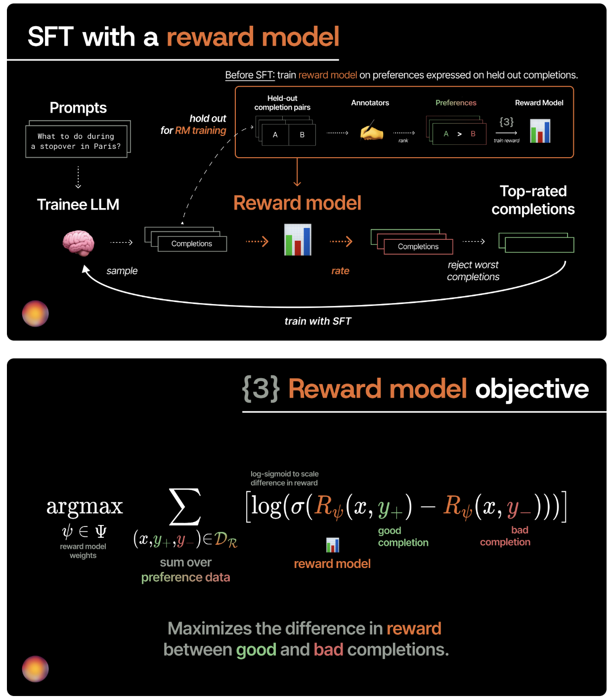
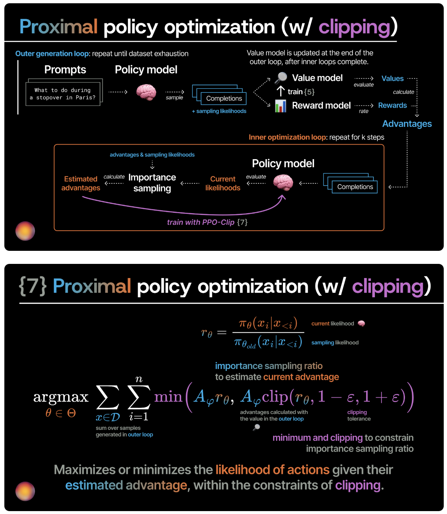
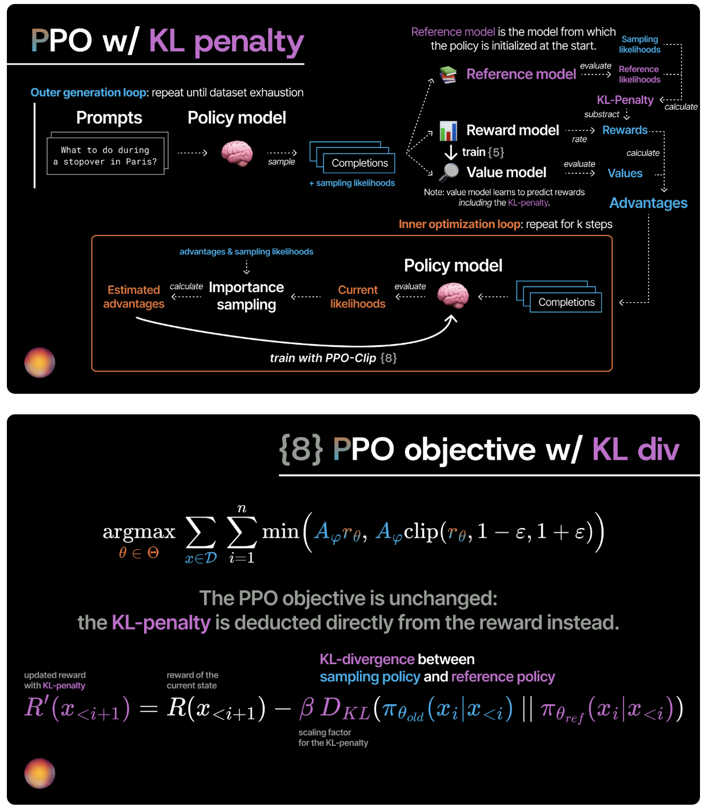

# PPO(Proximal Policy Optimization) -- 近端策略优化

> [!important]
> 
> 原论文：[Proximal Policy Optimization Algorithms](https://arxiv.org/pdf/1707.06347)
>
> 优秀博客：[from-zero-to-ppo](https://www.adaptive-ml.com/post/from-zero-to-ppo)、[spinningup.openai/ppo](https://spinningup.openai.com/en/latest/algorithms/ppo.html)
>
> TRL库：[huggingface/trl/ppo_trainer](https://github.com/huggingface/trl/blob/main/docs/source/ppo_trainer.md)


## 一、引言：从“会说话”到“说对话”——强化学习对齐的提出

### 1.1 大模型训练的三阶段

1. **预训练（Pre-training）** ：在海量文本上学习“**预测下一个词**”，让模型获得语言能力和世界知识。这个阶段模型学会了“怎么说话”。
2. **监督微调（SFT，Supervised Fine-Tuning）** ：在**人工标注的“指令-答案”对**上学习，让模型学会遵循指令、回答问题。这个阶段模型学会了“回答的格式”。
3. **基于人类反馈的强化学习（RLHF，Reinforcement Learning from Human Feedback）** ：让模型在开放生成中学会**符合人类复杂偏好**（如有益、诚实、无害）的回应。

### 1.2 强化学习对齐提出背景

**SFT的局限性在于：它本质上是“模仿学习”** 。模型学得再好，也只能达到数据集中标注者的水平。它只知道“**标准答案长什么样**”，却不知道“**什么样的回答更好**”——尤其是在面对“哪个回答更有帮助？”“哪个回复更富有同情心？”这类涉及主观偏好和复杂权衡的问题时，SFT的损失函数只关心“和标准答案像不像”，对此无能为力。

更关键的是，**互联网数据质量参差不齐**，大模型在预训练中不可避免地接触了大量低质量甚至有害内容。如果不加干预，模型可能会生成**虚构事实、偏见内容甚至有害信息**。这正是**对齐（Alignment）问题**的核心：模型的能力与**人类的意图和价值观（Alignment）** 出现了偏差。

**强化学习对齐**正是在这个背景下应运而生。它引入 **“奖励”信号** ——这个奖励可以来自一个**训练好的奖励模型**（学习人类偏好），也可以来自一套**规则**——让模型通过尝试不同的回答获得奖励反馈，学会**最大化期望奖励**。这就好比让学生从“死记硬背标准答案”变成了“理解评分标准并自由发挥”。

而**PPO（Proximal Policy Optimization，近端策略优化）** ，正是这个过程中最核心、最经典的策略优化算法。

---

## 二、PPO的核心思想

### 2.1 从策略梯度到PPO：为什么要“近端”？

- **策略梯度（Policy Gradient）**：这是强化学习中最朴素的优化思路，其核心公式——**策略梯度定理**——给出的优化方向是：

$$\nabla_\theta J(\theta) = \mathbb{E}_{\tau \sim \pi_\theta} \left[ \sum_{t=0}^T \nabla_\theta \log \pi_\theta(a_t|s_t) \cdot \Psi_t \right]$$

其中 $\Psi_t$ 可以是**累积奖励、优势函数**等。
这个公式在数学上是**无偏**的，但在实际使用中，我们通常只能通过**采样**来近似这个期望。由于采样数据的分布依赖于当前的策略 $\pi_\theta$，一旦策略发生更新，旧数据就不能再用了。这导致了**On-Policy**算法的低样本效率——**每次更新都要重新与环境交互采样**。

- **重要性采样（Importance Sampling）**：为了解决样本效率问题，研究者引入了**重要性采样（Importance Sampling）** ，使得我们可以**用旧策略 $\pi_{\theta_{old}}$ 采样的数据来估计新策略 $\pi_\theta$ 的期望梯度**：

$$\nabla_\theta J(\theta) = \mathbb{E}_{\tau \sim \pi_{\theta_{old}}} \left[ \frac{\pi_\theta(a_t|s_t)}{\pi_{\theta_{old}}(a_t|s_t)} \nabla_\theta \log \pi_\theta(a_t|s_t) \cdot A_t \right]$$

这里 $\frac{\pi_\theta}{\pi_{\theta_{old}}}$ 就是**概率比（Probability Ratio）**，记作 $r_t(\theta)$。
**重要性采样**让我们能更高效地利用数据，但也引入了一个风险：如果 $r_t(\theta)$ 过大（比如远大于1），说明新旧策略差异巨大，此时重要性采样的方差会急剧增大，导致**估计严重失真**。

- **PPO近端约束的动机**：我们希望利用**重要性采样**带来的效率提升，但必须通过**显式约束**来抑制 $r_t(\theta)$ 的剧烈波动。这个约束就是PPO中**裁剪（Clipping）机制**的设计原点。
  
- 从算法演进的角度看，PPO之前的**TRPO（Trust Region Policy Optimization）** 已经意识到了这个问题，它通过**KL散度约束**来严格限制更新步长，但TRPO需要计算二阶梯度（Fisher信息矩阵），计算开销极大。PPO的创新在于：**用一种计算量极小的“裁剪”操作，近似实现了TRPO的信任域约束效果**，使得算法既稳定又高效。

### 2.2 RLHF中的四大模型角色

在深入PPO的数学原理之前，需要先理解RLHF训练中同时存在的**四个模型**：

| 模型 | 功能定位 | 训练状态 | 核心作用 |
| :--- | :--- | :--- | :--- |
| **Actor**<br>策略网络 | 待优化主生成模型 | **可训练**<br>（LoRA/全参） | **策略优化主体**。接收逐Token状态，输出**动作概率分布**；通过**裁剪机制**在约束幅度内提升**高奖励**Token的生成概率，直接驱动模型向人类偏好调整。 |
| **Critic**<br>价值网络 | 状态价值估计器 | **可训练**<br>（常共享主干） | **方差调控器**。逐状态**评估价值**，生成基线以计算优势函数，显著降低策略梯度的估计方差，**保障训练稳定性**。 |
| **Reward Model**<br>奖励模型 | 人类偏好量化器 | **完全冻结**<br>（仅前向） | **目标信号源头**。输入完整生成轨迹，输出**单一全局奖励分数**，该分数注入后续优势估计，从根本上决定更新方向；**不参与梯度回传**。 |
| **Reference**<br>参考模型 | 分布约束基准 | **完全冻结**<br>（固定SFT权重） | **遗忘防火墙**。逐Token比较Actor与自身的输出分布差异，**施加惩罚以约束Actor**，防止过度优化奖励而牺牲语言流畅性和生成多样性。 |

这四个模型同时在显存中周转，这也是PPO训练**资源消耗巨大**的根源。

> [!tip]
> 
> 在PPO训练的动态闭环中，**Reward Model（RM）扮演着“人类意图的静态锚点”与“稀疏全局驱动力”的双重角色**。
>
> 
> 
> 它本质上是一个在离线偏好数据上训练好的、**参数完全冻结的判别式模型**，其最核心的技术特征在于**“全局性”与“滞后性”** —— 它**不参与逐Token的实时引导**，而是在Actor完整走完一条生成轨迹（Prompt + 完整Response）后，才输出一个**单一的、绝对的标量分数** $r$。这个分数是整条轨迹上唯一携带人类偏好信息的监督信号，直接决定了后续优势估计（GAE）中累积回报 $\hat{R}_t$ 的基准水平。
> 
> 由于RM仅提供“最终结果好坏”的宏观评价，而无法告知“哪个中间Token导致了高分”，它必须依赖**Critic网络**在逐Token层面进行“信用分配”（将全局$r$拆解为每个时间步的优势值）。同时，RM的绝对分数若不经约束极易失控，因此它生成的奖励必须与**Reference Model**施加的逐Token KL惩罚（$r_{final} = r_{RM} - \beta \cdot KL$）进行实时动态抵消，从而在“迎合人类偏好”与“保留原始语言能力”之间找到精细的平衡。正是这种“全局打分、冻结推理”的机制，使得RM成为RLHF中价值对齐的“北极星”，也是导致四模型同载时显存压力骤增（因RM体积常与Actor相当）的主要瓶颈之一。

### 2.3 PPO的核心目标函数

PPO的核心目标函数——即实际用于梯度更新的损失——实际上包含三个部分。理解这个**完整目标函数**的结构，是理解PPO如何同时兼顾“奖励追求”、“更新稳健”和“能力保持”三者的关键。

$$
L^{PPO}(\theta) = - \underbrace{L^{CLIP}(\theta)}_{\text{策略优化}} + \underbrace{c_1 \cdot L^{VF}(\theta)}_{\text{价值函数损失}} - \underbrace{c_2 \cdot S[\pi_\theta]}_{\text{熵奖励}}
$$

其中，**策略损失** $L^{CLIP}(\theta)$ 是PPO最具标志性的部分：

$$L^{CLIP}(\theta) = \mathbb{E}_{(s_t, a_t)} \left[\min\left(r_t(\theta) \cdot A_t,\ \text{clip}(r_t(\theta), 1-\epsilon, 1+\epsilon) \cdot A_t\right)\right]$$

逐一拆解这个公式的深层含义：

**（1）概率比 $r_t(\theta)$**

$$r_t(\theta) = \frac{\pi_\theta(a_t|s_t)}{\pi_{\theta_{old}}(a_t|s_t)}$$

这是**新策略**（当前正在训练的模型）与**旧策略**（更新前的模型）在同样状态下采取同样动作的概率之比。如果 $r_t(\theta) > 1$，说明新模型**更倾向于**生成这个回答；如果 $r_t(\theta) < 1$，说明新模型**不太愿意**生成这个回答。

**（2）优势函数 $A_t$**

$$A_t = Q(s_t, a_t) - V(s_t)$$

优势函数衡量的是“**当前这个动作相比平均水平好多少**”。如果 $A_t > 0$，说明这个回答比平均水平好，我们应该**增加**它的概率；如果 $A_t < 0$，说明这个回答不如平均水平，应该**降低**它的概率。

**基线（Baseline）通常由Critic网络（价值网络）估计**，用于减少方差、稳定训练。

**（3）裁剪机制 clip() 的深层设计逻辑**

$$\text{clip}(r_t(\theta), 1-\epsilon, 1+\epsilon)$$

这是PPO**最核心的创新点**。$\epsilon$ 通常取0.1 ~ 0.3。

为了更直观地理解裁剪，分两种情况分析目标函数的形状：

- **当 $A_t > 0$（好动作）时**：我们想要最大化 $r_t(\theta) \cdot A_t$，即希望**增加**该动作的概率。目标函数变为 $\min(r_t(\theta), 1+\epsilon) \cdot A_t$。这意味着当 $r_t(\theta) > 1+\epsilon$ 时，梯度变为0，**裁剪函数会“踩刹车”，强制停止在该方向上的推进**。这种非对称的梯度截断，有效防止了策略因一次侥幸的高奖励而**过度膨胀**。

- **当 $A_t < 0$（坏动作）时**：我们想要最小化 $r_t(\theta) \cdot A_t$（即降低概率），目标函数变为 $\max(r_t(\theta), 1-\epsilon) \cdot A_t$。当 $r_t(\theta) < 1-\epsilon$ 时，梯度同样被截断，**防止模型因为一次坏样本而过度惩罚某个动作**，导致**策略坍缩**。

**（4）min操作：保守更新**

$$\min\left(r_t(\theta) \cdot A_t,\ \text{clip}(r_t(\theta), 1-\epsilon, 1+\epsilon) \cdot A_t\right)$$

取两者的最小值，意味着PPO总是选择**更保守**的那个更新方向——这相当于给目标函数设置了一个**上界** ，**限制了单步更新的最大收益预期**。这种“宁可少赚，不可激进”的设计哲学，是PPO在大模型训练中稳健性的根本保证。



**（5）辅助项**

除了策略裁剪损失，完整目标函数还包括两个辅助项：

- **价值函数损失** $L^{VF}(\theta) = \mathbb{E}\left[\left(V_\theta(s_t) - V^{\text{target}}_t\right)^2\right]$：用于训练 **Critic网络（价值网络）**，使其对状态价值的估计**更准确**。通常采用Huber损失或裁剪后的MSE损失来增强稳定性。

- **熵奖励** ${S[\pi_\theta]} = \mathbb{E}\left[-\sum_a \pi_\theta(a|s_t) \log \pi_\theta(a|s_t)\right]$：鼓励策略保持一定的**探索性**，防止模型过早地退化为确定性策略（输出坍缩到单一模式）。

### 2.4 KL散度约束

除了裁剪机制，PPO在实际RLHF实现中通常还会在**奖励信号中直接加入KL惩罚项**，而不是仅在损失函数中。这意味着奖励模型给出的原始得分会被修正为：

$$R_{\text{total}}(s, a) = R_{\text{RM}}(s, a) - \beta \cdot KL(\pi_\theta(\cdot|s) || \pi_{\text{ref}}(\cdot|s))$$

其中 $KL(\pi_\theta || \pi_{\text{ref}}) = \mathbb{E}_{a \sim \pi_\theta} \left[\log \frac{\pi_\theta(a|s)}{\pi_{\text{ref}}(a|s)}\right]$。$\beta$ 是一个动态调整的超参数，控制约束的强度。



**这种设计的精妙之处在于**：它将约束直接作用于**奖励信号层面**，意味着模型在生成**每个token**时都会受到KL惩罚的影响，而非仅在最终更新时施加。这确保了模型在**追求高奖励（对齐）** 的同时，**不会完全丢失SFT阶段学到的良好语言能力**，实现了更细粒度的约束。

### 2.5 GAE优势估计

在实际实现中，PPO通常使用**GAE（Generalized Advantage Estimation，广义优势估计）** 来计算优势函数。GAE的核心是一个**截断的$\lambda$-回报**递归定义：

$$\delta_t = r_t + \gamma V(s_{t+1}) - V(s_t)$$

$$A^{\text{GAE}(\gamma, \lambda)}_t = \sum_{l=0}^{\infty} (\gamma \lambda)^l \delta_{t+l}$$

这个公式的物理含义是：GAE通过参数 $\lambda$ 在**时序差分（TD）估计**（$\lambda=0$，低方差、高偏差）和**蒙特卡洛估计**（$\lambda=1$，高方差、无偏）之间进行**平滑插值**。在LLM对齐实践中，$\lambda$ 通常取0.95~0.97，倾向于保留更多的蒙特卡洛信息，因为奖励模型给出的分数往往是**对整个完整回答的全局评价**，而非每个token的即时奖励。

---

## 三、PPO的训练流程

### 3.1 算法流程步骤

1.  **初始化**：加载**SFT模型**作为$Actor$ $\pi_\theta$ 和$Reference$ $\pi_{ref}$；初始化$Critic$网络 $V_\phi$ 和**奖励模型（$RM$）**。
2.  **数据收集（Rollout Phase）**：对于每个迭代轮次，$Actor$根据一组prompt生成固定长度（如2048个token）的**响应轨迹**。同时，Critic计算每个token状态的**价值** $V_\phi(s_t)$。
3.  **计算奖励（Reward Scoring Phase）**：利用$RM$对完整响应打分，并结合与 $\pi_{ref}$ 的逐token **KL散度**计算**最终奖励** $r_t$。同时，使用$GAE$计算出每个token的优势 $A_t$ 和目标价值 $\hat{V}_t^{target}$。
4.  **策略优化（Update Phase）**：将收集到的数据存入经验池。对经验池数据进行**多次**（如10-15次）**随机采样**，形成**小批量进行梯度更新**。
    - 计算新的概率比 $r_t(\theta)$。
    - 计算裁剪后的PPO目标函数 $L^{CLIP}$。
    - 计算价值损失 $L^{VF}$。
    - 反向传播更新Actor和Critic网络。
5.  **迭代**：清空经验池，用更新后的策略进入下一轮收集。

### 3.2 核心伪代码

典型的**PPO-based RLHF**训练流程构成了一个**迭代的经验收集与策略优化闭环**。

```python
# ==================== 初始化阶段 ====================
actor = Actor(init_from="SFT_model")      # 策略模型（待训练）
ref = Reference(init_from="SFT_model")     # 参考模型（冻结）
critic = Critic(init_from="RM_value_head") # 价值网络（待训练）
rm = RewardModel(load="reward_model")      # 奖励模型（冻结）

# 超参数配置
EPSILON = 0.2       # 裁剪范围
GAMMA = 1.0         # 折扣因子（LLM通常设为1，因为任务为episodic）
LAMBDA = 0.95       # GAE平滑系数
KL_BETA = 0.01      # KL惩罚系数
EPOCHS = 10         # 每批数据的复用轮数
BATCH_SIZE = 512    # 小批量大小

# ==================== 主训练循环 ====================
for iteration in range(total_iterations):
    
    # ---------- Step 1: 经验采样 (Rollout) ----------
    # 根据当前策略生成一批对话，收集完整轨迹
    trajectories = []
    for prompt in prompts_batch:
        # 自回归生成完整回答
        tokens, log_probs, values = actor.generate_with_values(prompt)
        # 计算参考模型下的log概率（用于KL计算）
        ref_log_probs = ref.compute_log_probs(tokens)
        # 奖励模型打分
        reward_score = rm.score(tokens)
        trajectories.append({
            "tokens": tokens,
            "log_probs": log_probs,      # 旧策略下的log概率
            "ref_log_probs": ref_log_probs,
            "values": values,             # 每个token位置的Critic估值
            "reward": reward_score        # 最终奖励（稀疏）
        })
    
    # ---------- Step 2: 优势计算 (GAE) ----------
    for traj in trajectories:
        # 计算token级别的即时奖励：最终奖励 + KL惩罚（每个token）
        token_rewards = []
        kl_divs = traj["log_probs"] - traj["ref_log_probs"]
        for t in range(len(traj["tokens"])):
            # 仅在最后一个token处获得RM得分，其余位置为0
            r = KL_BETA * kl_divs[t]  # 每个token施加KL惩罚
            if t == len(traj["tokens"]) - 1:
                r += traj["reward"]   # 最终奖励施加在最后一个token上
            token_rewards.append(r)
        
        # 计算GAE优势 (反向递推)
        advantages = []
        gae = 0.0
        for t in reversed(range(len(token_rewards))):
            # 注意：LLM中GAMMA通常为1，不进行折扣
            delta = token_rewards[t] + GAMMA * traj["values"][t+1] - traj["values"][t] if t+1 < len(traj["values"]) else token_rewards[t] - traj["values"][t]
            gae = delta + GAMMA * LAMBDA * gae
            advantages.insert(0, gae)
        
        traj["advantages"] = advantages
        traj["returns"] = [adv + val for adv, val in zip(advantages, traj["values"])]
    
    # ---------- Step 3: 策略更新 (多个epoch) ----------
    # 将所有轨迹拼接为一个大数据集
    dataset = flatten(trajectories)
    
    for epoch in range(EPOCHS):
        # 随机打乱并分批次更新
        for batch in sample_batches(dataset, BATCH_SIZE):
            # 计算当前策略下的概率比 r_t(θ)
            new_log_probs = actor.compute_log_probs(batch["tokens"])
            ratio = torch.exp(new_log_probs - batch["log_probs"])
            
            # ---------- 策略损失 (Clipped Surrogate Objective) ----------
            adv = batch["advantages"]
            # 正向/反向裁剪
            surr1 = ratio * adv
            surr2 = torch.clamp(ratio, 1 - EPSILON, 1 + EPSILON) * adv
            policy_loss = -torch.min(surr1, surr2).mean()  # 负号因为要梯度上升
            
            # ---------- 价值损失 (Value Function Loss) ----------
            # 使用裁剪后的value目标，防止价值网络更新过激
            value_pred = critic(batch["states"])
            value_clipped = batch["values"] + torch.clamp(value_pred - batch["values"], -EPSILON, EPSILON)
            vf_loss1 = (value_pred - batch["returns"]) ** 2
            vf_loss2 = (value_clipped - batch["returns"]) ** 2
            value_loss = 0.5 * torch.max(vf_loss1, vf_loss2).mean()
            
            # ---------- 熵奖励 (Entropy Bonus) ----------
            entropy = actor.compute_entropy(batch["states"]).mean()
            entropy_loss = -entropy  # 最大化熵 = 最小化 -熵
            
            # ---------- 总损失 ----------
            loss = policy_loss + 0.5 * value_loss + 0.01 * entropy_loss
            
            # 梯度更新
            optimizer.zero_grad()
            loss.backward()
            # 梯度裁剪 (防止梯度爆炸)
            torch.nn.utils.clip_grad_norm_(actor.parameters(), max_norm=1.0)
            optimizer.step()
    
    # ---------- Step 4: 迭代结束，旧策略更新为新策略 ----------
    # 下一轮迭代中，actor即为当前的最新策略，用于采样
```

**要点总结**：

1. **经验收集（Rollout）** 和 **参数更新（Update）** 是严格分离的两个阶段，这正是PPO作为**Off-Policy（但基于重要性采样的近似On-Policy）** 算法的体现。
2. **价值网络的更新**采用了与策略网络类似的**裁剪机制**，这并非原论文的标准形式，而是后续实现中证实有效的工程改进，可以显著提升Critic训练的稳定性。
3. **多个Epoch的重复利用**是PPO样本效率的核心来源。但需要注意的是，过高的EPOCHS值会导致**分布漂移**过大，从而使重要性采样失效。实践中通常取10~15轮。

---

## 四、PPO的适用场景、优势与局限、演进方向

### 4.1 适应场景

1. **初始模型质量较高的场景**：PPO需要在一个**已经经过充分SFT的模型**基础上进行优化。如果SFT模型本身质量不佳，PPO容易陷入“低质量区域”的局部最优。
2. **需要精细控制策略更新的任务**：如对话系统的安全性强化、内容生成偏好控制等。PPO的信任域约束使其能精准控制优化幅度。
3. **模型规模较大的场景**：通常适合 >70B 参数的**大模型**，某云厂商的千亿参数模型训练显示，PPO可使有害内容生成率降低82%。
4. **已有奖励模型或可获取大量用户反馈的场景**：如推荐系统、客服对话优化等。PPO能够高效利用这些偏好信号。
5. **追求理论完备性和收敛性保证的场景**：PPO有严格的数学证明支撑，在连续动作空间任务中也有良好表现。

### 4.2 核心优势

| 优势 | 说明 |
|------|------|
| **理论完备** | 有严格的收敛性证明，且与TRPO的信任域理论一脉相承 |
| **训练稳定** | **裁剪机制+KL约束**防止策略崩溃，适用于大模型微调 |
| **样本效率高** | 支持多轮epoch重复利用数据，比传统On-Policy算法效率高数倍 |
| **实现简洁** | 相比TRPO无需计算二阶梯度，工程实现友好 |
| **灵活性高** | 支持离散/连续动作空间，可适配**多种奖励模型**架构 |

### 4.3 核心局限

| 局限 | 说明 |
|------|------|
| **资源消耗巨大** | **需同时维护Actor/Critic/Reward/Reference四个大模型**，GPU显存压力极大 |
| **超参数敏感** | $\epsilon$、$\beta$、$\lambda$、学习率等需精细调优，不同规模模型的最佳配置差异显著 |
| **Critic网络训练困难** | **价值函数估计误差**会传导至策略更新，大模型场景下Critic容易过拟合，且价值网络与策略网络共享参数时存在优化冲突 |
| **奖励模型质量决定上限** | 如果奖励模型本身不能准确反映人类偏好，PPO的效果将大打折扣——所谓"Garbage in, garbage out" |
| **训练不稳定风险** | 尽管已有改进，PPO仍可能出现**奖励震荡（Reward Spiking）、熵崩溃（Entropy Collapse）、策略发散**等问题，需要大量工程trick来稳定 |

### 4.4 演进方向

1. **问题一：Critic网络成为瓶颈。** PPO需要同时训练Actor和Critic两个网络，Critic的价值估计误差会直接影响策略更新的质量。而价值网络在大规模语言模型上的训练本身就极其困难，容易过拟合。这催生了**GRPO（Group Relative Policy Optimization）**——由DeepSeek提出，**通过组内相对优势估计替代绝对价值估计**，完全去除了Critic网络，显著降低了显存占用和训练复杂度。
2. **问题二：奖励模型的标定问题。** 传统RLHF依赖Bradley-Terry模型将成对偏好转化为**标量奖励**，但这种奖励在不同prompt之间缺乏标定——同样的分数在不同语境下意义不同。这催生了**Pairwise PPO（P3O）**和**统一配对框架（Unified Pairwise Framework）**——直接在成对比较上操作，绕过标量奖励近似的局限，实现了更精确的偏好建模。
3. **问题三：训练效率低下。** 四个大模型的顺序执行导致大量GPU资源闲置，Actor生成样本时Critic和RM等模型处于空闲状态。这催生了**OPPO（Pipeline Overlap PPO）**——通过流水线重叠技术将训练和推理阶段并行化，实现了1.8倍的端到端训练加速。
4. **问题四：KL约束的动态调整。** 固定系数的KL惩罚无法适应训练过程中策略漂移的非平稳性。自适应KL控制（Adaptive KL Control）技术通过实时监控KL散度并动态调整$\beta$系数，已成为现代RLHF工程实践的标准配置。

---

> [!note]
> 
> PPO之所以能成为大模型强化学习对齐的基石，核心在于它回答了一个根本问题：**如何在追求目标（最大化奖励）的同时，确保过程是稳定和可控的？**
> 
> 它通过两个精妙的设计回答了这个问题：
> 
> - **裁剪机制**：在数学层面限制了策略更新的最大幅度，防止重要性采样的方差爆炸
> - **KL散度约束**：在语义层面确保模型不会“忘本”，维持生成质量的下限
> 
> 这两个机制共同构成了PPO的“信任域”，让大模型能够在“保持自我”的前提下，稳步地向人类偏好方向进化。
> 
> 从ChatGPT到GPT-4，从Claude到各类开源对话模型，PPO都是其实现与人类价值观对齐的核心技术基石。理解PPO，不仅需要看懂它的公式，更需要理解它的设计动机——为什么需要裁剪？为什么需要KL约束？为什么需要GAE？这些问题背后的答案，共同构成了现代大模型“从会说话到说对话”这一蜕变的核心密码。