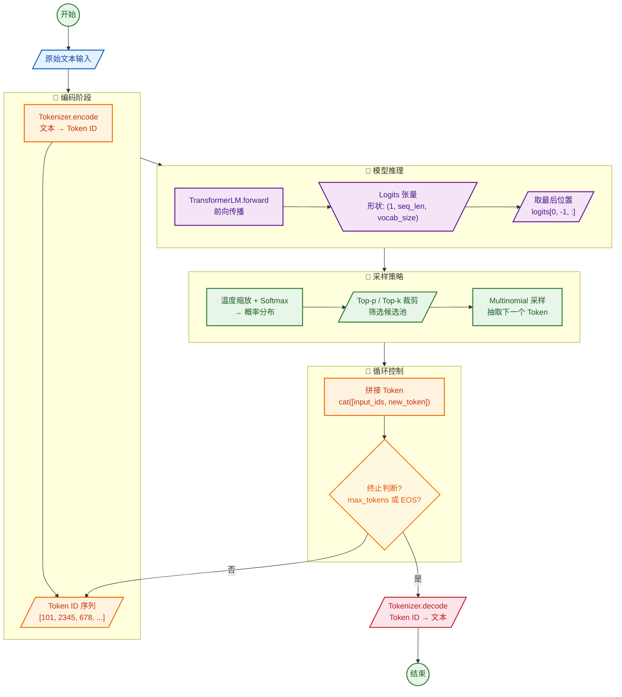

# Transformer Inference Generation —— 推理生成式语言模型

## 引言

经过前六篇博客的漫长旅程，我们完成了从原始文本到可训练模型的全部构建工作：**BPE分词器**将文本转化为数字序列，**基础算子**模块搭建了Transformer的骨架，**注意力机制**赋予了模型捕捉长距离依赖的能力，**完整的训练系统**让模型从数据中学习知识，**消融实验**则用科学方法验证了每一个设计决策。

现在，我们来到了这趟旅程的终点环节 —— **让模型真正“开口说话”** 。

训练好的语言模型权重只是一堆冰冷的数字，只有在**推理**（Inference）时刻，这些数字才被激活为**连贯的、有意义的文本**。**推理**是训练中积累的知识得以转化为实际输出的唯一途径。无论对话、搜索、问答还是代码生成，所有能力都在推理中被激活与呈现。

本篇博客将深入探讨语言模型推理的完整技术栈：
- **自回归生成**：为什么语言模型必须“一个字一个字地”向外输出
- **生成策略**：从贪心解码到**温度采样**，从Top-k到**Top-p**，如何控制输出的**质量与多样性**
- **模型加载**：如何从**检查点恢复**训练好的权重，跳过漫长的重新训练
- **完整推理流程**：从原始文本到生成文本的**端到端数据流**
- **性能优化**：**KV Cache等推理加速技术**的原理与权衡
- **项目回顾**：总结整个系列的技术栈与收获，展望未来方向

---

## 一、自回归生成

### 1.1 从训练到推理的范式转换

**训练阶段**输入完整的token序列，利用**因果掩码**让每个位置只能看到**前面的token**，模型一次性计算出**所有位置的下一个token预测**。由于训练输入是已知的完整序列，模型可以将整个序列视作一个**大批次，通过一次大矩阵乘法并行计算所有位置的前向表示**。

**推理阶段则完全不同**。推理时**没有“真实标签”可用**，模型必须**自己生成序列**——每生成一个token，就将它**追加到输入序列的末尾**，作为**下一步预测**的依据。这个过程被称为**自回归生成（Autoregressive Generation）**。

可以把LLM的推理过程想象成在写作文：每写一个字都要回头看前面已经写好的内容。**用户的输入提示（prompt）和已生成的文本被视为一个单一序列**，模型在此基础上进行**续写**。

数学上，**自回归语言模型在每个时间步预测下一个token的概率分布：$P(x_t | x_{<t})$，其中 $x_{<t}$ 表示所有已生成的token**。解码时，将前面**已生成的token**作为输入，预测下一个token，循环迭代直到**满足终止条件（达到最大长度或遇到结束标记EOS）**。

### 1.2 推理与训练的本质差异

训练与推理虽都涉及模型的前向计算，但它们的**目标、计算模式和资源瓶颈存在本质差异**：

| 维度 | 训练 | 推理 |
|------|------|------|
| 前文来源 | **真实标签**（ground-truth） | **模型自己生成的token** |
| 并行性 | 可**并行计算**所有位置 | 必须逐token**串行生成** |
| 瓶颈 | **算力**（FLOPs） | **显存容量与内存带宽** |
| 核心诉求 | **优化模型参数** | **快速、低成本地生成** |

训练阶段需要执行**完整的前向与反向传播**，保留中间激活用于**梯度计算**，瓶颈主要来自**大规模矩阵乘法的算力需求和跨设备通信**。

而推理阶段的目标是**用固定参数生成输出序列**，速度并不主要受**算力**限制，而是受**显存容量和内存带宽**的制约——因为每生成一个新token，模型都必须处理**越来越长的上下文**。

### 1.3 代码实现

在`T_Generate_text.py`中，`generate_text`函数实现了完整的自回归生成流程：

```python
def generate_text(model, tokenizer, prompt, max_tokens=256, temperature=1.0, top_p=0.9, device="cpu", eos_token="<|endoftext|>"):
    model.eval()
    
    # 编码提示文本
    prompt_tokens = tokenizer.encode(prompt)
    input_ids = torch.tensor(prompt_tokens, dtype=torch.long, device=device).unsqueeze(0)
    generated_tokens = prompt_tokens.copy()
    
    with torch.no_grad():
        for _ in range(max_tokens):
            # 前向传播获取logits
            logits = model(input_ids)
            next_token_logits = logits[0, -1, :]  # 只取最后一个位置的logits
            
            # 应用温度缩放和采样
            probabilities = softmax_with_temperature(next_token_logits, temperature)
            if top_p < 1.0:
                probabilities = top_p_sampling(probabilities, top_p)
            
            # 采样下一个token
            next_token = torch.multinomial(probabilities, num_samples=1).item()
            generated_tokens.append(next_token)
            
            # 检查是否遇到EOS
            if eos_token is not None:
                decoded_token = tokenizer.decode([next_token])
                if decoded_token.strip() == eos_token.strip():
                    break
            
            # 更新输入序列
            next_token_tensor = torch.tensor([[next_token]], dtype=torch.long, device=device)
            input_ids = torch.cat([input_ids, next_token_tensor], dim=1)
            
            # 防止序列超长
            if input_ids.size(1) > model.context_length:
                input_ids = input_ids[:, -model.context_length:]
    
    return tokenizer.decode(generated_tokens)
```

**关键点**：
1. **逐token生成**：`for _ in range(max_tokens)` 循环控制生成步数
2. **只看最后一个位置：`logits[0, -1, :]` 只取最后一个token的预测分布**——因为只有最后一个位置是**新预测**的，前面位置的预测已经完成
3. **增量式输入更新**：每生成一个新token，就**通过`torch.cat`将其拼接到输入序列末尾**
4. **上下文长度保护**：当序列超过`context_length`时，**截断最前面的token**，防止内存溢出
5. **提前终止**：检测到**EOS token**时立即**停止生成**

---

## 二、生成策略：控制输出质量与多样性

模型输出的logits经过softmax后得到概率分布，但**如何从这个分布中选择下一个token**，直接决定了生成文本的**质量、多样性和风格**。

### 2.1 从Logits到概率分布

当模型接收到输入后，最后一层输出的是一个**logits向量 —— 长度为词汇表大小 $V$ 的实数向量**，每个值表示对应token的“**原始得分**”。

Softmax函数将这些**原始得分**转换为**概率分布**：

$$p_i = \frac{e^{z_i}}{\sum_{j=1}^{V} e^{z_j}}$$

**所有 $p_i$ 均为正数且总和为1**。

### 2.2 贪心解码（Greedy Decoding）

最直接的策略：**每次选择概率最高的token** —— `next_token = torch.argmax(probabilities, dim=-1)`

- **优点**：**确定性强，结果可复现**，适合需要**准确性**的任务（如代码生成、数学推理）。
- **缺点**：**文本缺乏多样性，可能陷入重复循环**。模型一旦“走偏”就无法自我纠正，因为贪心解码**没有探索机制**。

### 2.3 温度采样（Temperature Sampling）

**温度采样通过一个参数 $T$ 来调整概率分布的“尖锐”或“平滑”程度**：

$$p_i = \frac{\exp(z_i / T)}{\sum_j \exp(z_j / T)}$$

- **$T < 1$：分布更尖锐 → 更确定，模型倾向于选择高概率token**
- **$T = 1$**：原始分布不变
- **$T > 1$：分布更平滑 → 更随机，低概率token也有机会被选中**

代码实现：

```python
def softmax_with_temperature(logits, temperature=1.0):
    scaled_logits = logits / temperature
    max_logits = torch.max(scaled_logits, dim=-1, keepdim=True)[0]
    exp_logits = torch.exp(scaled_logits - max_logits)
    probabilities = exp_logits / torch.sum(exp_logits, dim=-1, keepdim=True)
    return probabilities
```

温度参数就像一个“风险调节器”——**较低的温度值可以让模型保守行事，而高温则鼓励冒险尝试不太可能的词汇**。

**温度采样的典型取值范围**：**0.2 ~ 0.4**适合事实性问答、代码生成（需要**准确性**）；**0.7 ~ 1.0**：适合故事创作、头脑风暴（需要**创意性**）

### 2.4 Top-k采样

**Top-k采样**将候选范围限制为**概率最高的k个token**，**其余token的概率被置零并重新归一化**。

```python
def top_k_sampling(probabilities, k):
    top_k_probs, top_k_indices = torch.topk(probabilities, k, dim=-1)
    # 构造掩码，只保留top-k位置
    mask = torch.zeros_like(probabilities)
    mask.scatter_(-1, top_k_indices, 1.0)
    filtered_probs = probabilities * mask
    return filtered_probs / filtered_probs.sum(dim=-1, keepdim=True)
```

- **优点**：**减少低概率词的影响**，避免生成胡言乱语。
- **缺点**：k值是固定的，**不会根据模型置信度动态调整**。k值小了过于保守，限制创造力；k值大了又可能引入噪声。

### 2.5 Top-p（核采样 / Nucleus Sampling）

**Top-p采样**（又称核采样）不固定候选数量，而是**选取概率累积和达到阈值 $p$ 的最小token集合**。

```python
def top_p_sampling(probabilities, p=0.9):
    sorted_probs, sorted_indices = torch.sort(probabilities, descending=True, dim=-1)
    cumulative_probs = torch.cumsum(sorted_probs, dim=-1)
    mask = cumulative_probs <= p
    mask[..., 0] = True  # 至少保留最高概率的token
    
    filtered_probs = sorted_probs * mask.float()
    filtered_probs = filtered_probs / filtered_probs.sum(dim=-1, keepdim=True)
    
    output_probs = torch.zeros_like(probabilities)
    output_probs.scatter_(-1, sorted_indices, filtered_probs)
    return output_probs
```

- **优点**：候选池**根据上下文动态调整** —— 模型自信时池子小（**更确定**），模型不确定时池子大（**更多样**）。这往往能产生**更自然的文本**。
- **典型取值范围**：0.85 ~ 0.95 通常能产生**流畅自然**的输出。

### 2.6 策略组合：最佳实践

在实际应用中，**温度采样通常与Top-k或Top-p结合使用**。推荐的组合策略：
1. **先用Top-p或Top-k裁剪候选池**（控制“**广度**”）
2. **再用温度调整池内概率分布**（控制“**锐度**”）

典型配置：
- 创意写作：`temperature=0.8, top_p=0.9`
- 事实问答：`temperature=0.3, top_p=0.95`
- 代码生成：`temperature=0.2, top_k=40`

---

## 三、从检查点恢复模型

训练一个语言模型可能需要数小时甚至数天。**每次推理时都重新训练显然不可行**。**检查点（Checkpoint）机制**让我们可以**保存训练好的权重，随时加载使用**。

### 3.1 检查点的保存

在`S_Checkpoint.py`中，**`save_checkpoint`函数将模型状态、优化器状态和当前迭代次数打包保存：**
```python
def save_checkpoint(model, optimizer, iteration, out):
    checkpoint = {
        'model_state_dict': model.state_dict(),
        'optimizer_state_dict': optimizer.state_dict(),
        'iteration': iteration,
    }
    torch.save(checkpoint, out)
```
训练脚本会在以下时机**保存检查点**：
- **定期保存**：每`--save_intervals`步（**默认1000步**）
- **最佳模型**：当验证损失达到**历史最低**时
- **最终模型**：**训练结束**时

### 3.2 检查点的加载

**`load_checkpoint`函数恢复模型权重和优化器状态：**

```python
def load_checkpoint(src, model, optimizer):
    checkpoint = torch.load(src)
    model.load_state_dict(checkpoint['model_state_dict'])
    optimizer.load_state_dict(checkpoint['optimizer_state_dict'])
    iteration = checkpoint['iteration']
    return iteration
```

### 3.3 推理时的模型加载

在`T_Generate_text.py`中，**`load_model_and_tokenizer`函数从检查点加载模型用于推理：**

```python
def load_model_and_tokenizer(checkpoint_path, vocab_path, merges_path, device="cpu"):
    # 1. 加载分词器
    tokenizer = Tokenizer.from_files(vocab_path, merges_path)
    
    # 2. 加载检查点获取模型配置
    checkpoint = torch.load(checkpoint_path, map_location=device)
    config = checkpoint.get('model_config', checkpoint.get('config', default_config))
    
    # 3. 创建模型（使用保存的配置）
    model = TransformerLM(**model_kwargs).to(device)
    
    # 4. 加载权重
    model.load_state_dict(checkpoint['model_state_dict'])
    
    return model, tokenizer
```

**关键设计**：检查点中不仅保存了**权重**，还保存了**模型配置**（`d_model`、`n_layers`等）。这使得加载时**无需手动指定架构参数**——模型可以自己记住自己的结构。

---

## 四、完整的推理流程

现在可以串联起整个推理流程的每一个环节：



### 4.1 预处理阶段

```python
prompt_tokens = tokenizer.encode(prompt)
input_ids = torch.tensor(prompt_tokens, dtype=torch.long, device=device).unsqueeze(0)
```

分词器将原始文本（如“Once upon a time”）转换为**token ID序列**（如`[1234, 567, 890, ...]`），然后包装为**形状`(1, seq_len)`的张量**。

### 4.2 生成阶段

每一步生成都包含：
1. **前向传播**：模型将**当前输入序列**映射为**logits**
2. **分布变换：logits → 温度缩放 → softmax → 概率分布**
3. **候选池裁剪：Top-p或Top-k过滤低概率token**
4. **采样**：从过滤后的分布中**抽取一个token**

### 4.3 后处理阶段

```python
generated_text = tokenizer.decode(generated_tokens)
```

将所有生成的**token ID（包括原始prompt的token和新生成的token）通过分词器的`decode`方法转换**回人类可读的文本。

### 4.4 使用示例

```bash
python cs336_basics/T_Generate_text.py \
    --checkpoint checkpoints/base_experiment/checkpoint_final_5000.pt \
    --vocab data/vocab.pkl \
    --merges data/merges.pkl \
    --prompt "Once upon a time" \
    --max_tokens 100 \
    --temperature 0.8 \
    --top_p 0.9
```

---

## 五、推理性能优化：KV Cache

### 5.1 问题的本质

在自回归生成中，**每生成一个新token，模型都需要重新计算整个序列的注意力**。这意味着：
- 第1步：计算1个token的注意力
- 第2步：计算2个token的注意力（重新计算了第1步的所有内容）
- 第N步：计算**N个**token的注意力（重复计算了前N-1步的所有内容）

这种**重复计算**导致了巨大的算力浪费。**随着上下文长度增加，计算量呈平方级增长**。

### 5.2 KV Cache

**KV Cache**的核心思想是**把历史token的Key和Value缓存下来，下次生成时直接用，避免重新计算**。

在Transformer的每一层中，对于每个已生成的token，我们都有其**Key向量和Value向量**。在生成新token时，**不需要重新计算已有token的K和V，只需要计算新token的K和V**，将新token的K、V追加到**缓存**中，用**完整的K、V缓存**计算注意力。

这就像写作文时有个“记忆本”——每写一个字就把要点记下来，**后面写新内容时不用从头翻看**整篇作文，只需翻阅这个记忆本。

KV Cache是一种典型的“**用内存换计算**”的工程优化。**收益**是将注意力计算的复杂度从 $O(N^2)$ 降低到 $O(N)$，但需要付出**显存占用随序列长度线性增长**的代价。在长上下文推理中，KV Cache的大小甚至可能超过**模型权重**本身，造成**严重的内存和带宽瓶颈**。

### 5.3 代码项目与KV Cache

在当前的代码实现中，**尚未集成KV Cache —— 每次生成都从头计算整个序列的注意力**。

但在实际生产环境中，KV Cache是**必须实现的优化**。没有KV Cache，长文本生成的效率将无法接受。集成KV Cache可以**对`CausalMultiHeadAttention`的forward逻辑进行改造**：

1. 在**推理**模式下，接收一个**可选的`past_kv`参数**
2. **只计算新token的Q、K、V**
3. **将新K、V与`past_kv`拼接**
4. **返回更新后的KV缓存供下一步使用**

### 5.4 前沿的KV Cache优化

近年来，研究者提出了大量KV Cache优化技术：
- **KV Cache压缩**：通过**降维、聚类**等方法减小缓存大小
- **KV Cache驱逐**：根据**重要性动态淘汰**部分缓存的KV
- **前缀缓存**：在批处理中**共享公共前缀的KV Cache**

这些技术使得超长上下文（百万token级别）的推理成为可能，是LLM工程化部署的核心技术之一。

---

## 六、项目总结与展望

### 6.1 技术栈全景回顾

整个项目构建了一套**完整的、从零实现的Transformer语言模型**技术栈：

| 层级 | 组件 | 对应博客 |
|------|------|----------|
| **数据预处理** | **BPE分词器、预分词策略** | 博客一 |
| **基础算子** | **Linear、Embedding、RMSNorm、SwiGLU、RoPE** | 博客二 |
| **注意力机制** | **缩放点积注意力、因果掩码、多头注意力** | 博客三 |
| **模型组装** | **TransformerBlock、TransformerLM** | 博客四 |
| **训练系统** | **交叉熵损失、数据加载器、AdamW、余弦调度、梯度裁剪** | 博客五 |
| **实验验证** | **消融实验设计、结果分析** | 博客六 |
| **推理部署** | **自回归生成、采样策略、检查点加载** | 博客七 |

**代码规模**：约20个核心Python模块，覆盖从数据预处理到模型推理的完整链路。

**工程工具链**：
- **PyTorch**：深度学习框架，所有模块从 **`nn.Parameter`和基础张量**操作构建
- **einops**：优雅的**张量维度变换**
- **wandb**：实验追踪与可视化
- **pytest**：单元测试（项目中虽未显式展示，但CS336作业体系包含完整测试）
- **uv**：Python环境与依赖管理

### 6.2 从零实现的核心收获

**1. 深入理解每一行代码**

使用`torch.nn.Linear`只需要一行代码，但从零实现`LinearModule`让我们理解了**权重初始化、梯度传播和参数管理**的全部细节。这种“造轮子”的过程虽然耗时，但对理解**深度学习系统的运作机制**无可替代。

**2. 设计决策的科学验证**

通过**消融实验**，我们用数据验证了**RMSNorm、Pre-Norm、RoPE、SwiGLU**等现代LLM设计选择的必要性。这不仅是对文献的复现，更是对“**为什么这样做**”的深刻理解。

**3. 训练与推理的完整闭环**

**从原始文本到训练数据，从模型构建到训练优化，从权重保存到推理生成** —— 我们走完了整个技术栈的每一个环节。这种端到端的视角是使用现成框架无法获得的。

**4. 工程化思维的培养**

**命令行参数、检查点管理、wandb日志、消融实验自动化**——这些“非模型”的工程细节，恰恰是让研究可复现、可扩展的关键。

### 6.3 未来扩展方向

**1. 更大的模型与更多的数据**

当前项目在TinyStories（~4.5MB）上训练了小规模模型（d_model=512, 4层）。下一步可以：
- 在**更大数据集**（如OpenWebText、C4）上训练
- **扩展模型规模**（d_model=768, 12层，接近GPT-2 small）
- 使用**多GPU分布式训练**

**2. 推理优化**

- **集成KV Cache**，大幅提升生成速度
- **实现Flash Attention**，降低内存占用
- 支持**批量推理**（同时处理多个prompt）

**3. 模型能力扩展**

- 实现**SFT（监督微调）**，让模型学会**遵循指令**
- 实现**RLHF（基于人类反馈的强化学习）**，让模型输出**更符合人类偏好**
- 实现**对话式交互（维护对话历史）**

**4. 深入研究**

- 探索**不同的位置编码方案**（ALiBi、相对位置编码等）
- 研究**不同的归一化策略**（LayerNorm vs RMSNorm vs 无归一化）
- 探索**MoE（混合专家）架构**

> [!note] 结语
> 
> 从第一篇博客的**BPE分词器**，到最后一篇的**文本生成**，我们完成了一次**完整的、从零开始的大语言模型**构建之旅。这七篇博客不仅是技术教程，更是一次对深度学习科研方法论的全景演示：
> - **理论驱动**：每个设计决策都有其**数学原理和文献依据**
> - **代码实现**：所有模块**从零构建**，不依赖黑盒封装
> - **实验验证**：用**消融实验**科学地验证每一个设计选择
> - **工程落地**：**从训练到推理**的完整闭环，让模型真正“开口说话”